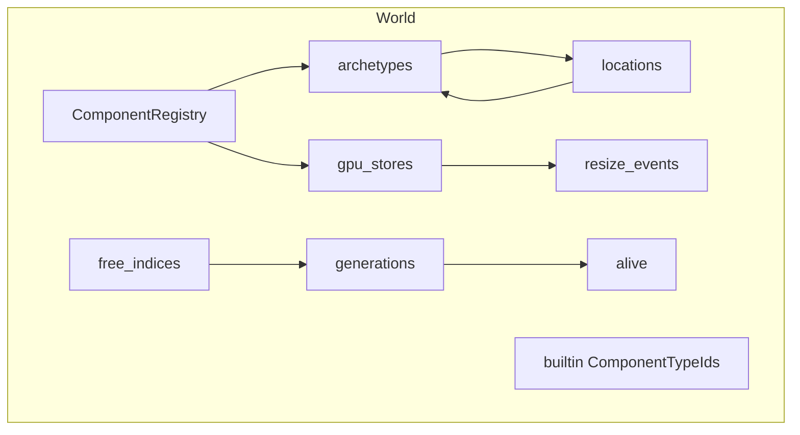
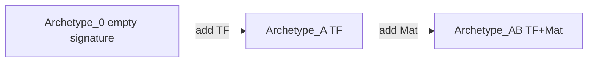
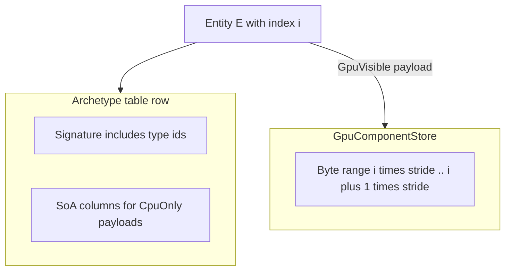
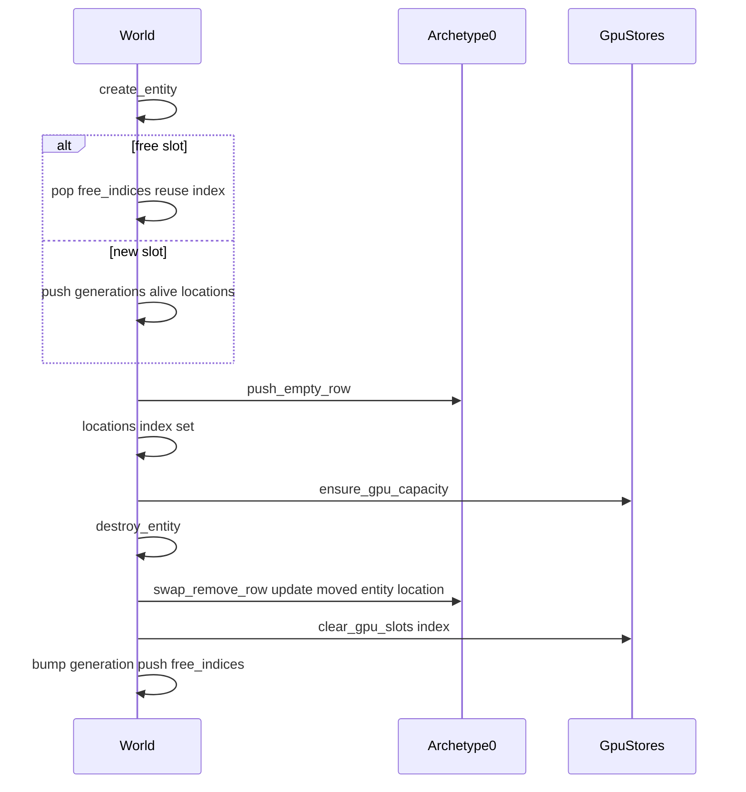
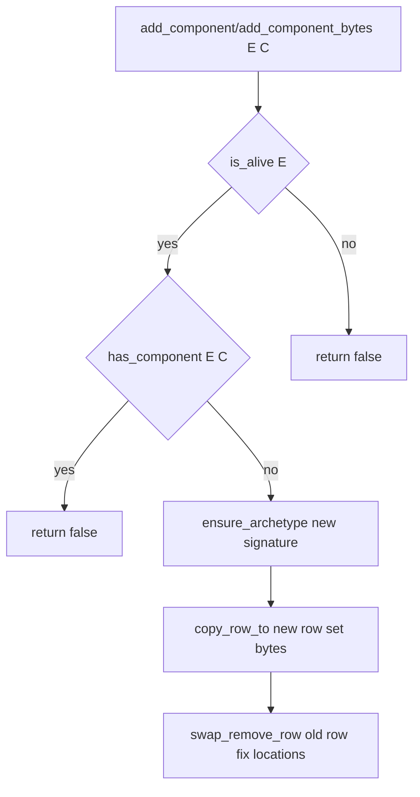
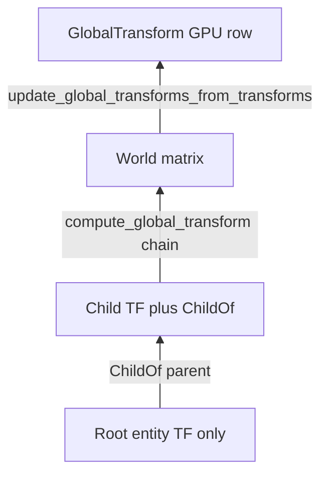

# Rhodonite Core ECS (`emadurandal/rhodonite_core/ecs`)

**Languages:** [日本語 (Japanese)](ecs_ja.md)

[`moon/rhodonite_core/src/ecs/`](../moon/rhodonite_core/src/ecs/) is an **archetype**-based ECS. On the CPU, components live in **SoA (Structure of Arrays)** tables for cache-friendly column iteration. For WebGPU, **`EntityId.index` is a stable logical subscript** into storage buffers: **GPU-visible** component payloads live in a **flat array separate from archetype rows**, while CPU-only data stays in archetype SoA columns.

External `System` / `Schedule` types are available, but `World` itself does not own systems. Row iteration is exposed through `Query`; built-in helpers are implemented on top of the same internal iterator.

For a machine-readable API listing, see [`pkg.generated.mbti`](../moon/rhodonite_core/src/ecs/pkg.generated.mbti).

---

## Core types

| Type | Role |
|------|------|
| `EntityId` | Dense `index` (GPU subscript / array slot) plus `generation`, bumped on destroy/reuse. Stale handles fail `is_alive`. |
| `ComponentTypeId` | Opaque id assigned monotonically by `ComponentRegistry`. |
| `EntityLocation` | Which archetype table and row a live entity occupies. |
| `ComponentKind` | `CpuOnly` (payload in SoA column) / `GpuVisible` (signature in archetype only; payload in flat `GpuComponentStore`). |
| `RegisteredComponent` | Name, `kind`, `cpu_stride`, optional `gpu_layout`. |
| `GpuWrite` | Owned GPU upload slice (`byte_offset` + `FixedArray[Byte]`), kept for APIs that need ownership. |
| `GpuWriteView` | Borrowed GPU upload slice (`byte_offset` + `ArrayView[Byte]`) for immediate zero-copy-style upload paths. |

---

## `World` internals



- **`generations` / `alive` / `free_indices`**: Slot reuse and generation tracking.
- **`locations`**: `EntityId.index` → `EntityLocation?` (archetype index and row).
- **`archetypes`**: One SoA table per signature (CPU component payloads). Each column tracks a `row_capacity` watermark separately from the logical row count so appends can grow backing storage without leaking spare capacity to query column views.
- **`gpu_stores`**: Parallel array to registry indices, `GpuComponentStore?` (`Some` only for GPU-visible types). Stores keep flat payload bytes, per-row dirty flags, batched dirty ranges, and a packed active-index set for owned GPU-visible rows.
- **`resize_events`**: Queue of notifications when flat stores grow (buffer recreation / full upload may be needed).

---

## Archetypes and SoA

- Each archetype’s **signature** is a **sorted ascending** list of `ComponentTypeId`; entities with the same set share one table.
- A new `World` starts with **archetype 0 = empty signature**; freshly spawned entities sit there until components are added ([`World::new` in `world.mbt`](../moon/rhodonite_core/src/ecs/world.mbt)).
- Each CPU column stores packed `bytes` with fixed `stride`; row `row` starts at offset `row * stride`.
- Column backing may have more capacity than live rows. Public `QueryArchetype::read_column` / `write_column` expose only `entities.length() * stride` logical bytes, not spare capacity.



For a visual of “columns = components, rows = entities”, see below.


---

## Where `CpuOnly` vs `GpuVisible` live



- **CpuOnly**: Bytes live in the archetype SoA column. When an entity moves archetypes, its **row index** changes, but overlapping columns are copied with `copy_row_to`.
- **GpuVisible**: The archetype row only records the **type id** in the signature (`cpu_stride == 0`). Payload bytes always sit in the **flat store** at **`entity.index * stride`**. Archetype row motion does **not** change the GPU slot index.
- GPU-visible ownership is also mirrored in a packed active-index set (`World::gpu_component_active_indices`). `add_component*` activates the entity slot; `remove_component` and `destroy_entity` zero-clear and deactivate it.

---

## Entity lifecycle



### Bulk spawning built-in transforms

For large static batches that need the built-in `Transform3D` + `GlobalTransform` pair, use `World::spawn_transform_global_batch(count, write)`.

This API creates entities directly in the `[Transform3D, GlobalTransform]` archetype, avoiding the normal sequence of:

1. spawn into the empty archetype,
2. migrate when `Transform3D` is added,
3. migrate again when `GlobalTransform` ownership is added.

The callback receives direct row views:

```moonbit
let entities = world.spawn_transform_global_batch(count, fn(i, entity, tf_row, gt_row) {
  @comp.Transform3D::write_trs_to_component_mut_view(
    tf_row,
    px,
    py,
    pz,
    0.0,
    0.0,
    0.0,
    1.0,
    sx,
    sy,
    sz,
  )
  @comp.global_transform_write_identity_row(gt_row)
  ignore(i)
  ignore(entity)
})
```

The callback must fully initialize both rows. `Transform3D::write_trs_to_component_mut_view` and `global_transform_write_identity_row` exist for this purpose and avoid intermediate `FixedArray[Byte]` allocations.

For arbitrary component signatures, use `World::spawn_batch(components, count, write)`. It canonicalizes the signature, appends entities directly to the matching archetype, activates any `GpuVisible` slots, and marks those GPU rows dirty as one contiguous range when entity indices are dense.

```moonbit
let entities = world.spawn_batch([cpu_component, gpu_component], count, fn(i, entity, row) {
  let cpu = row.write_view(cpu_component)
  let gpu = row.write_view(gpu_component)
  cpu[0] = i.to_byte()
  gpu[0] = entity.gpu_index().to_byte()
})
```

The row callback runs while ECS views are borrowed, so structural mutation APIs are still rejected inside it. This keeps the direct append path from invalidating the row views it hands out.

---

## Adding/removing components and archetype migration

`add_component` / `add_component_bytes` / `remove_component` in short:

1. If the signature **already** contains the type, return `false`; existing CPU payloads are updated with `set_component_bytes`.
2. Otherwise **materialize** a new signature’s archetype via `ensure_archetype`.
3. Allocate a **new row** for the entity, `copy_row_to` overlapping columns.
4. Apply zero/default payload on `add_component`, or the supplied CPU/GPU payload on `add_component_bytes`.
5. **Remove** the old row with `swap_remove_row`. If the last row moved, **`update_moved_location`** fixes that entity’s `locations` entry.



---

## Query API

Use `Query::new(required)` and `query.for_each(world, f)` for row iteration. Only archetypes whose signature **contains every** id in `required` are visited. If `required` is empty, the query returns immediately.

The callback receives a `QueryRow`, so payloads are accessed by component id while preserving read/write access checks.

- `required` becomes a named value that can be reused by a system.
- `Query::new` rejects duplicate component ids up front.
- The input array is copied, so later changes to the caller's array cannot change query payload order.
- During schedule execution, every required component must be declared in the active System's `reads` or `writes` set.
- `QueryRow::read_view(component)` returns a zero-copy `ArrayView[Byte]` for the component: a SoA row for `CpuOnly`, or the flat GPU row for `GpuVisible`.
- `QueryRow::write_view(component)` returns a zero-copy `MutArrayView[Byte]` and requires the component to be declared in the active System's `writes` set during schedule execution. For `GpuVisible` components, requesting this mutable view marks that entity row dirty immediately.
- If a GPU store grows during iteration, a `GpuResizeEvent` may be queued (`needs_full_upload`, etc.).

For hot loops over CPU-only data, prefer `Query::for_each_archetype`. It builds a small per-archetype access cache (`component`, kind, column index, stride) once per matched archetype, so `QueryArchetype::component_stride`, `read_column`, and `write_column` do not re-scan columns on every call. GPU-visible columns still cannot be read as archetype columns because their payload rows are keyed by `EntityId.index`.

If a row callback is still the right shape for the system, prepare the query once and call `PreparedQuery::for_each(world, f)`. Like `PreparedQuery::for_each_archetype`, it rebuilds once when `world.archetype_version` changes, but otherwise reuses the matched archetype plan instead of scanning every archetype on each frame.

```moonbit
let query = Query::new([tf, gt])
query.for_each(world, fn(row) {
  let tf_bytes = row.read_view(tf)
  let global_tf = @comp.GlobalTransform::view_std140_gpu_row(row.write_view(gt))
  ignore(tf_bytes)
  ignore(global_tf)
})
```

```moonbit
let query = Query::new([tf])
query.for_each_archetype(world, fn(chunk) {
  let stride = chunk.component_stride(tf)
  let tf_column = chunk.write_column(tf)
  for row = 0; row < chunk.length(); row = row + 1 {
    let e = chunk.entity(row)
    let base = row * stride
    // update tf_column[base .. base + stride]
    ignore(e)
  }
})
```

---

## CommandBuffer

World mutation APIs such as `create_entity`, `destroy_entity`, `add_component`, `add_component_bytes`, `remove_component`, `set_component_bytes`, and `clear_gpu_component` are guarded during active query iteration. Calling them from a query callback aborts because archetype rows and mutable payload views could be invalidated.

Use the `CommandBuffer` passed to a `System` when a query/system wants to request changes during iteration:

```moonbit
let system = System::new_with_structural_write(
  "replace-component",
  Update,
  [],
  [old_component, new_component],
  fn(world, _ctx, commands) {
    query.for_each(world, fn(row) {
      let spawned = commands.create_entity()
      commands.remove_component(row.entity(), old_component)
      commands.add_component_bytes(row.entity(), new_component, bytes)
      commands.add_component_bytes(spawned, new_component, spawn_bytes)
    })
  },
)
```

`Schedule::run` creates the command buffer for each system and validates queued commands against that system's `writes` / `structural_write` declaration. Within a phase, conflict-free systems are grouped into greedy batches. Commands are applied after every system in the batch returns, preserving system registration order and each buffer's insertion order. `commands.create_entity()` reserves an `EntityId` immediately; the reserved entity is not alive until apply, but later commands in the same buffer can add components to it.

---

## System and Schedule

`World` does not own systems. The first system layer is an external `Schedule` containing function-backed `System` values.

```moonbit
let schedule = Schedule::new()
schedule.add_system(System::new("Move", Update, [], [transform], fn(world, ctx, commands) {
  // query world, optionally enqueue structural changes into commands
}))
let _ = schedule.run(world, SystemContext::new(0.016, frame_index))
```

`Schedule::run` is single-threaded. It runs phases in this order: `PreUpdate`, `Update`, `PostUpdate`, `PreRender`, `RenderExtract`. Systems in the same phase keep registration order but are split into conflict-free greedy batches. Each system receives a fresh `CommandBuffer`; systems in the same batch cannot observe each other's queued changes, while later batches can observe commands applied by earlier batches.

`Schedule::run` temporarily closes component registration while systems are running, then reopens it before returning. Use `World::component_registration_locked()` to inspect that state.

`System::reads` and `System::writes` are metadata for scheduling and batching. They are validated for duplicates and copied on construction. `System::conflicts_with(other)` detects write/write, write/read, and read/write overlap, and `Schedule::has_parallel_access_conflicts()` reports whether systems in the same phase have access conflicts that force separate batches. `Schedule::run` remains single-threaded but uses the same conflict rules for batch splitting.

The built-in transform update can also be registered with `transform_propagation_system(world)`. That system runs the same work as `World::update_global_transforms_from_transforms` in the `PostUpdate` phase, declaring `Transform3D` / `ChildOf` as reads and `GlobalTransform` as a write.

`update_global_transforms_from_transforms` keeps archetypes without `ChildOf` on the direct fast path and sends only archetypes that include `ChildOf` through the hierarchy-aware path. A scene can therefore mix a large flat batch with a smaller parented set without forcing the flat batch through ancestor traversal.

---

## GPU upload and resize

- **`drain_gpu_writes(component)`**: Sorts dirty entity indices, merges contiguous runs, and also consumes already batched dirty ranges recorded by bulk paths. It returns `GpuWrite` slices (`byte_offset` + `bytes`) suitable for `write_buffer_from_fixed_array` (or similar).
- **`drain_gpu_write_views(component)`**: Same dirty consumption semantics, but returns borrowed `GpuWriteView` slices (`byte_offset` + `ArrayView[Byte]`). Use this when the caller can upload immediately before mutating the same GPU component store again. This avoids the extra `FixedArray[Byte]` payload copy in ECS drain paths.
- **`gpu_component_active_indices(component)`**: Returns a copy of the packed active `EntityId.index` values for a GPU-visible component. This is useful for renderer-side extraction or future packed update paths without scanning every possible entity slot.
- **`drain_resize_events`**: Drains notifications when backing arrays grow; callers may need to **recreate GPU buffers** and optionally **full-upload**. During `Schedule::run`, this consumes a world-owned event queue and requires `structural_write`; outside schedule execution it can be called directly.

`add_component`, `add_component_bytes`, `component_bytes`, and `set_component_bytes` handle both CPU-only and GPU-visible components. CPU-only payloads live in archetype SoA rows; GPU-visible payloads live in flat GPU rows keyed by `EntityId.index`. GPU store capacity growth and `GpuResizeEvent` creation go through one internal `World` path. Both JS and non-JS targets grow GPU stores geometrically; upload spans are exposed as borrowed `ArrayView[Byte]` values for immediate zero-copy upload.

For WebGPU uploads, `rhodonite_webgpu/webgpu` provides:

- `GPUQueue::write_buffer_from_fixed_array` for owned `GpuWrite` payloads.
- `GPUQueue::write_buffer_from_array_view` for borrowed `GpuWriteView` payloads. JS forwards this as a `Uint8Array.subarray` to `GPUQueue.writeBuffer`; native forwards the `ArrayView[Byte]` backing bytes plus source offset to `wgpuQueueWriteBuffer` without compacting the view into a new `Bytes`.

Example: [`ecs-scene-graph` `render_frame`](../moon/rhodonite_examples/src/ecs-scene-graph/common/webgpu_renderer.mbt) uses the owned drain path. [`ecs-mass-cubes`](../moon/rhodonite_examples/src/ecs-mass-cubes/common/webgpu_renderer.mbt) uses `spawn_transform_global_batch`, then calls `write_global_transforms_dense_range_views` with sample-owned callbacks that bulk-write the dense `GlobalTransform` range. The initialization callback writes the full mat4 rows; the per-frame callback updates only the CPU-side Y translation lane. Because the GPU buffer still stores mat4 rows, the borrowed upload range remains the full dense row span. The library only provides the dense range and dirty tracking; grid-wave math stays in the sample.
The browser-only [`ts-ecs-mass-cubes`](../demos/ts-ecs-mass-cubes.html) demo uses the TypeScript ECS wrapper for the same dense-range callback path and submits borrowed write views with the native browser WebGPU API. The [`wasm-ecs-mass-cubes`](../demos/wasm-ecs-mass-cubes.html) demo builds a MoonBit `wasm-gc` entrypoint for the dense ECS update and calls a TypeScript host bridge for browser WebGPU work, because wasm-gc host imports cannot directly pass MoonBit `ArrayView[Byte]`/`Bytes` into `GPUQueue.writeBuffer`.

Dense GlobalTransform helper variants:

- `write_global_transforms_dense(...) -> Array[GpuWrite]`
- `write_global_transforms_dense_views(...) -> Array[GpuWriteView]`
- `write_global_transforms_dense_range_views(count, write) -> Array[GpuWriteView]`

`write_global_transforms_dense_range_views` is the high-throughput variant for user-defined logic. It calls `write` once with a `GpuComponentWriteRange` (`bytes`, `stride`, `first_entity_index`, `count`), allowing caller code to run a tight loop over contiguous rows without a callback per entity.

---

## TypeScript wrapper

The JS target also exposes an ECS bridge and TypeScript wrappers under [`moon/rhodonite_core/src/ecs/ts/`](../moon/rhodonite_core/src/ecs/ts/). The wrapper currently covers the `World` + `Query` surface: entity lifecycle, component registration, built-in component ids, row/chunk query views, GPU write-view drains, resize events, and built-in transform upload helpers. `Schedule`, `System`, and `CommandBuffer` are intentionally not wrapped yet.

The wrapper keeps the ECS zero-copy policy explicit:

- `QueryRow::read_view` / `write_view`, `QueryArchetype::read_column` / `write_column`, and `GpuWriteView.bytes` are surfaced as `ByteView`.
- `ByteView` stores the original MoonBit `{ buf, start, end }` view and reads/writes through that backing storage directly.
- `ByteView.asUint8Array()` returns a zero-copy `Uint8Array.subarray(...)` only when the backing storage is already typed, which is the normal GPU-store upload path.
- CPU SoA columns may be backed by a JS number array. Those are still zero-copy through `ByteView.get`, `set`, `getF32`, and `setF32`; converting them to a `Uint8Array` requires the explicitly named `toUint8ArrayCopy()`.
- Copying APIs are named accordingly in TS, for example `componentBytesCopy` and `drainGpuWritesCopy`. Prefer `drainGpuWriteViews` for immediate WebGPU uploads.

```ts
import { GpuLayout, Query, World } from "./moon/rhodonite_core/src/ecs/ts/index.ts";

const world = World.new();
const material = world.registerGpuComponent("Material", GpuLayout.empty(16));
const entity = world.createEntity();
world.addComponent(entity, material);

Query.new([material]).forEach(world, (row) => {
  const bytes = row.writeView(material);
  bytes.setF32(0, 1.0);
});

for (const write of world.drainGpuWriteViews(material)) {
  const bytes = write.bytes().asUint8Array();
  if (bytes === null) throw new Error("GPU write view must be typed");
  // queue.writeBuffer(buffer, write.byteOffset(), bytes);
}
```

---

## Built-in components (three)

Registered in `World::new` in this order (`ComponentTypeId.index` 0, 1, 2):

| Order | Name | Kind | Role |
|-------|------|------|------|
| 0 | `Transform3D` | CpuOnly | Local TRS, etc., in SoA. `set_transform` / `get_transform`. |
| 1 | `GlobalTransform` | GpuVisible | World matrix (std140-friendly layout) in flat GPU store. `set_global_transform` / `get_global_transform`. |
| 2 | `ChildOf` | CpuOnly | Parent `EntityId` index/generation. `set_child_of` / `get_child_of`. |

Hierarchy and world matrix:



- **`compute_global_transform`**: Walks `ChildOf` toward the root (fails on cycles or dead parents), multiplies `Transform3D` matrices into a world matrix.
- **`update_transform3d_positions`**: Bulk-updates only the position field of built-in `Transform3D` without constructing a `QueryRow` per entity. JS uses the public archetype-column path; non-JS uses a direct archetype sweep with fixed-offset f32 writes.
- **`update_global_transforms_from_transforms`**: Bulk-updates every entity that has **both** built-in transforms. Archetypes without `ChildOf` write `GlobalTransform` rows directly and record contiguous dirty ranges when possible; archetypes with `ChildOf` use the hierarchy-aware path and read parent links directly from the `ChildOf` column.

---

## Registering custom components

- **`World::register_cpu_component(name, cpu_stride)`**: Stride for SoA storage; appends `None` to `gpu_stores`.
- **`World::register_gpu_component(name, gpu_layout)`**: Requires `GpuLayout::is_valid`; appends `Some(GpuComponentStore::new(...))`.

Register components outside active schedule execution. `Schedule::run` temporarily closes registration while systems run, then reopens it before returning; registering new component types between schedule runs is allowed.

Layout helpers: [`gpu_layout.mbt`](../moon/rhodonite_core/src/ecs/components/gpu_layout.mbt) (`GpuLayout::std140`, `GpuLayout::empty`, etc.).

---

## Minimal API cookbook

Sketch only—**imports and package aliases omitted**. In a real package, add `@ecs`, `@matrix44`, etc. in `moon.pkg`.

```moonbit
// World and entity
let world = World::new()
let e = world.create_entity()

// Built-ins
ignore(world.set_transform_trs(e, 0.0, 0.0, 0.0, 0.0, 0.0, 0.0, 1.0, 1.0, 1.0, 1.0))
ignore(world.set_global_transform(e, Matrix44F::identity()))

// Custom CPU component
let tag = world.register_cpu_component("Tag", 4)
ignore(world.add_component_bytes(e, tag, tag_bytes))

// Query (e.g. TF + GT together)
let required = [world.transform_component(), world.global_transform_component()]
let query = Query::new(required)
query.for_each(world, fn(row) {
  let tf_row = row.read_view(world.transform_component())
  let gt_row = row.write_view(world.global_transform_component())
  ...
})

// End of frame: partial GPU upload
let gt = world.global_transform_component()
let writes = world.drain_gpu_writes(gt)
// queue.write_buffer_from_fixed_array(buffer, w.byte_offset, w.bytes)

// Immediate borrowed upload path
let views = world.drain_gpu_write_views(gt)
// queue.write_buffer_from_array_view(buffer, v.byte_offset, v.bytes)
```

---

## Tests and source map

Behavior is pinned in [`ecs_test.mbt`](../moon/rhodonite_core/src/ecs/ecs_test.mbt) (archetype moves, generation reuse, logical column length after capacity growth, packed GPU active indices, merged `drain_gpu_writes` / `drain_gpu_write_views` ranges, bulk transform spawn, std140 padding, etc.).

The ECS microbench package lives at [`moon/rhodonite_core/src/ecs_bench/`](../moon/rhodonite_core/src/ecs_bench/). From the repository root:

```bash
pnpm run bench:ecs        # JS target
pnpm run bench:ecs:js
pnpm run bench:ecs:native
pnpm run bench:ecs:wasm   # wasm-gc build only
```

Core implementation files:

- [`types.mbt`](../moon/rhodonite_core/src/ecs/types.mbt) — data structures
- [`world.mbt`](../moon/rhodonite_core/src/ecs/world.mbt) — entities, archetypes, queries
- [`archetype.mbt`](../moon/rhodonite_core/src/ecs/archetype.mbt) — SoA / swap-remove
- [`registry.mbt`](../moon/rhodonite_core/src/ecs/registry.mbt) — registration
- [`gpu_store.mbt`](../moon/rhodonite_core/src/ecs/gpu_store.mbt) — flat stores and dirty queues
- [`world_transform3d.mbt`](../moon/rhodonite_core/src/ecs/world_transform3d.mbt) / [`world_global_transform.mbt`](../moon/rhodonite_core/src/ecs/world_global_transform.mbt) / [`world_child_of.mbt`](../moon/rhodonite_core/src/ecs/world_child_of.mbt) — built-in APIs
