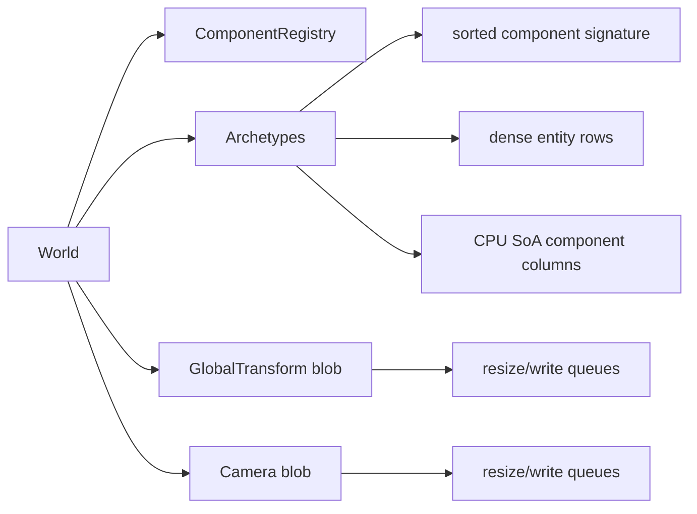

# ECS

[`moon/rhodonite_core/src/ecs/`](../moon/rhodonite_core/src/ecs/) is an archetype-based ECS. Components are CPU-only: payload bytes live in archetype SoA columns, and component membership is represented by the archetype signature.

GPU upload data is handled by dedicated builtin packed blob stores, not by arbitrary ECS component storage. `GlobalTransform` and `Camera` store small CPU refs in SoA rows and write their matrix payloads into packed GPU blobs with their own resize/write queues.

## Core Types

| Type | Role |
|------|------|
| `EntityId` | Stable entity index plus generation. Stale handles are rejected after destroy/reuse. |
| `ComponentTypeId` | Opaque registry id used in archetype signatures and query descriptors. |
| `RegisteredComponent` | Component metadata: id, name, and CPU SoA row stride. |
| `Archetype` | Dense table for entities with the same sorted component signature. |
| `ComponentColumn` | One packed byte column for one CPU component type. |
| `Query` / `RawQuery` | High-level row iteration and expert archetype-column iteration. |
| `GpuWriteView` | Borrowed upload slice returned by builtin packed blob stores. |
| `PackedGpuBlobResizeEvent` | Resize event for builtin packed GPU blobs. |

## Storage Model



- All user-registered ECS components are CPU SoA components.
- `World::register_cpu_component(name, cpu_stride)` registers a component and appends one component-archetype index slot.
- `add_component`, `add_component_bytes`, `remove_component`, `set_component_bytes`, and `component_bytes` operate only on archetype SoA rows.
- Entity moves between archetypes copy overlapping CPU columns with `copy_row_to`; row indices may change, but `EntityId` remains stable.
- `GlobalTransform` and `Camera` are CPU ref components. Their GPU matrix bytes are stored in `GlobalTransformBlobStore` and `CameraBlobStore`.

## Builtins

| Index | Component | Storage | Notes |
|-------|-----------|---------|-------|
| 0 | `Transform3D` | CPU SoA | Local TRS. `set_transform` / `get_transform`. |
| 1 | `GlobalTransform` | CPU SoA ref + packed blob | CPU row stores `{ format, word_offset }`; matrix bytes live in the GlobalTransform blob. |
| 2 | `ChildOf` | CPU SoA | Parent `EntityId` index/generation. |
| 3 | `Camera` | CPU SoA ref + packed blob | CPU row stores `{ word_offset }`; camera bytes live in the Camera blob. |

## Queries

`Query::new(required)` yields `QueryRow` values. `QueryRow::read(component, f)` and `QueryRow::write(component, f)` borrow the CPU row bytes only for the closure body.

`RawQuery::for_each_archetype` yields `RawQueryArchetype` chunks. `read_column` and `write_column` return contiguous logical column views for the matched archetype, sized to `row_count * stride`.

Queries reject duplicate required components. Structural mutation and direct payload setters are guarded while a query callback is active, because archetype rows and borrowed views could otherwise be invalidated.

## Mutation And Scheduling

`Schedule` does not own a fixed update/render lifecycle. Callers supply named `PhaseKey` values and either run one phase with `Schedule::run_phase` or pass an explicit phase order to `Schedule::run`. `World` mutation APIs are guarded by `System` access declarations during schedule execution:

| Operation | Required declaration |
|-----------|----------------------|
| `has_component`, `component_bytes`, query prepare/iteration | `reads` or `writes` |
| `set_component_bytes`, query row writes | `writes` |
| `create_entity`, `destroy_entity`, `add_component*`, `remove_component`, `spawn_batch` | `structural_write` plus relevant component `writes` |
| builtin blob resize event drains | `structural_write` |

Use `CommandBuffer` inside systems to queue entity/component structural changes until the current query/system callback finishes.

## Builtin GPU Blob Uploads

Generic ECS components no longer expose GPU upload queues. Render extraction should use builtin blob APIs:

- `drain_global_transform_blob_write_views`
- `drain_global_transform_blob_resize_events`
- `drain_camera_blob_write_views`
- `drain_camera_blob_resize_events`
- `write_global_transform_blob_range_views`
- `write_global_transform_blob_range_by_refs`

The returned `GpuWriteView` values borrow the packed blob backing storage. Upload them before mutating the same blob again.

## TypeScript Wrapper

The TypeScript wrapper in [`moon/rhodonite_core/src/ecs/ts/`](../moon/rhodonite_core/src/ecs/ts/) mirrors the CPU-only ECS surface:

- `World.registerCpuComponent`
- `World.addComponent*`, `setComponentBytes`, `componentBytesCopy`
- `Query`, `RawQuery`, `SpawnBatchRow`
- builtin blob upload helpers such as `drainGlobalTransformBlobWriteViews`

`GpuLayout` remains available as a layout/packing helper for builtin row formats and renderer code; it is no longer used to register ECS component storage.

## Validation

Behavior is pinned in [`ecs_test.mbt`](../moon/rhodonite_core/src/ecs/ecs_test.mbt) and [`world.test.ts`](../moon/rhodonite_core/src/ecs/ts/world.test.ts). Run:

```bash
moon check --target all
pnpm run test:core:mbt
pnpm run test:core:js
```
