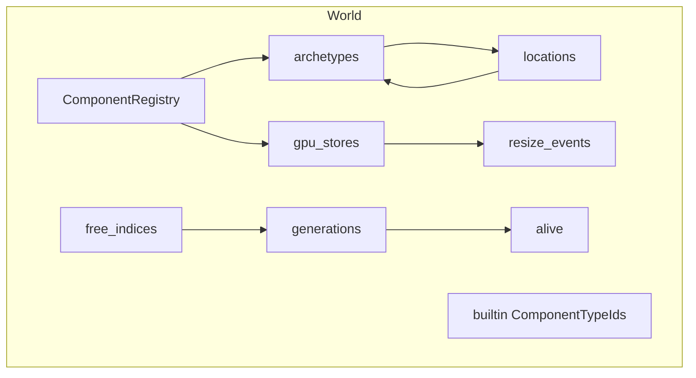
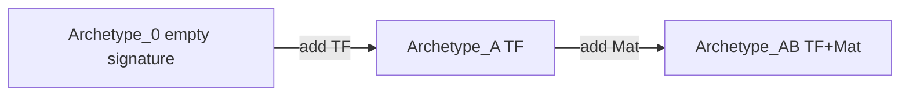
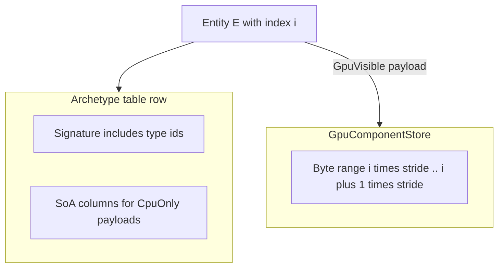
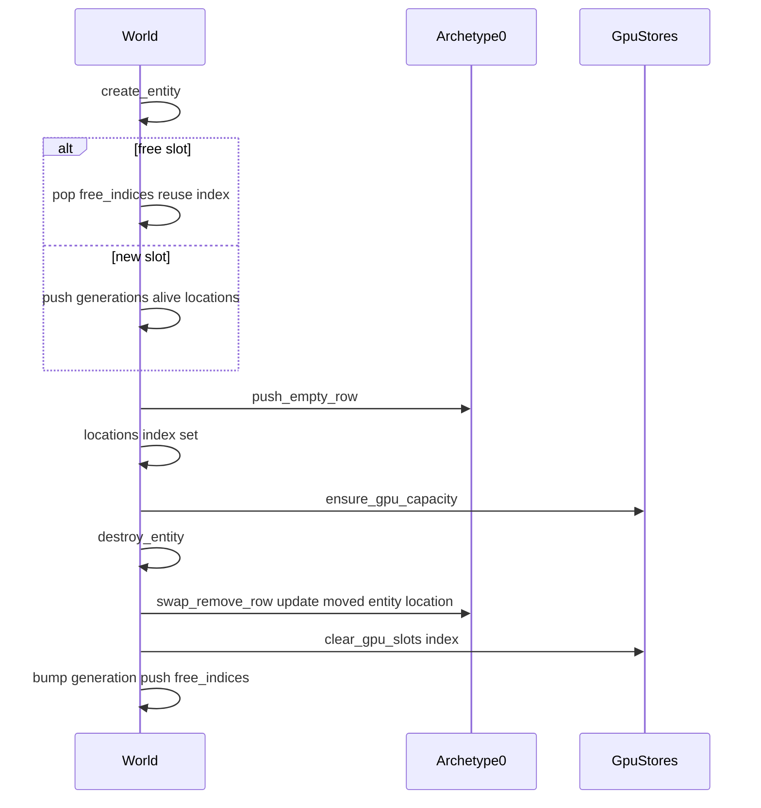
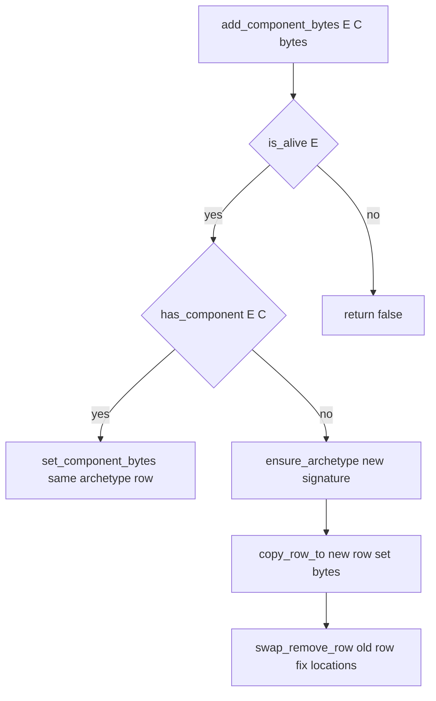
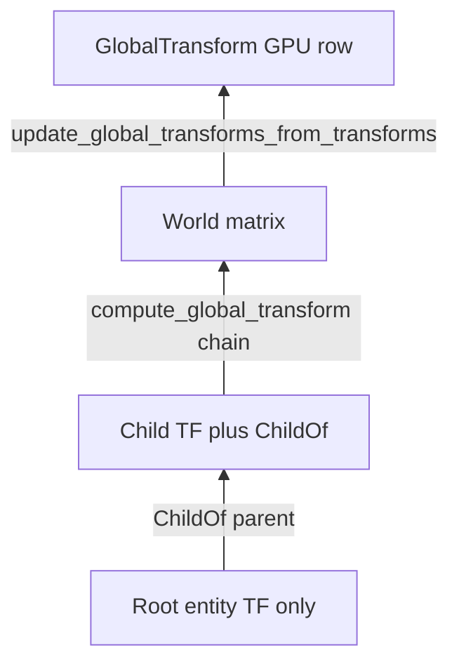

# Rhodonite Core ECS (`emadurandal/rhodonite_core/ecs`)

**Languages:** [日本語 (Japanese)](ecs_ja.md)

[`moon/rhodonite_core/src/ecs/`](../moon/rhodonite_core/src/ecs/) is an **archetype**-based ECS. On the CPU, components live in **SoA (Structure of Arrays)** tables for cache-friendly column iteration. For WebGPU, **`EntityId.index` is a stable logical subscript** into storage buffers: **GPU-visible** component payloads live in a **flat array separate from archetype rows**, while CPU-only data stays in archetype SoA columns.

There is no separate `System` type: querying and updates are done through `World` methods (especially `for_each_entity_with_components`) and built-in helpers.

For a machine-readable API listing, see [`pkg.generated.mbti`](../moon/rhodonite_core/src/ecs/pkg.generated.mbti).

---

## Core types

| Type | Role |
|------|------|
| `EntityId` | Dense `index` (GPU subscript / array slot) plus `generation`, bumped on destroy/reuse. Stale handles fail `is_alive`. |
| `ComponentTypeId` | Opaque id assigned monotonically by `ComponentRegistry`. |
| `EntityLocation` | Which archetype table and row a live entity occupies. |
| `ComponentKind` | `CpuOnly` (payload in SoA column) / `GpuVisible` (signature in archetype only; payload in flat `GpuComponentStore`). |
| `RegisteredComponent` | Name, `kind`, `cpu_stride`, optional `gpu_layout`. |

---

## `World` internals



- **`generations` / `alive` / `free_indices`**: Slot reuse and generation tracking.
- **`locations`**: `EntityId.index` → `EntityLocation?` (archetype index and row).
- **`archetypes`**: One SoA table per signature (CPU component payloads).
- **`gpu_stores`**: Parallel array to registry indices, `GpuComponentStore?` (`Some` only for GPU-visible types).
- **`resize_events`**: Queue of notifications when flat stores grow (buffer recreation / full upload may be needed).

---

## Archetypes and SoA

- Each archetype’s **signature** is a **sorted ascending** list of `ComponentTypeId`; entities with the same set share one table.
- A new `World` starts with **archetype 0 = empty signature**; freshly spawned entities sit there until components are added ([`World::new` in `world.mbt`](../moon/rhodonite_core/src/ecs/world.mbt)).
- Each CPU column stores packed `bytes` with fixed `stride`; row `row` starts at offset `row * stride`.



For a visual of “columns = components, rows = entities”, see below.


---

## Where `CpuOnly` vs `GpuVisible` live



- **CpuOnly**: Bytes live in the archetype SoA column. When an entity moves archetypes, its **row index** changes, but overlapping columns are copied with `copy_row_to`.
- **GpuVisible**: The archetype row only records the **type id** in the signature (`cpu_stride == 0`). Payload bytes always sit in the **flat store** at **`entity.index * stride`**. Archetype row motion does **not** change the GPU slot index.

---

## Entity lifecycle



---

## Adding/removing components and archetype migration

`add_component_bytes` / `remove_component` in short:

1. If the signature **already** contains the type, **overwrite** bytes in the same archetype row.
2. Otherwise **materialize** a new signature’s archetype via `ensure_archetype`.
3. Allocate a **new row** for the entity, `copy_row_to` overlapping columns.
4. Apply the new write (on add).
5. **Remove** the old row with `swap_remove_row`. If the last row moved, **`update_moved_location`** fixes that entity’s `locations` entry.



---

## Query API: `for_each_entity_with_components`

- Only archetypes whose signature **contains every** id in `required` are visited. If `required` is empty, the function returns immediately.
- The callback receives `(entity, full_signature, payloads)` where `payloads[k]` matches `required[k]` as a **`MutArrayView[Byte]`**:
  - **CpuOnly**: view into that row’s SoA column.
  - **GpuVisible**: view into the **flat `GpuComponentStore`** slot for `entity.index` (not archetype SoA).
- If you **mutate GpuVisible bytes** inside the callback, rows are **not** automatically marked dirty unless the path already does so. Call `World::mark_gpu_component_dirty` so `drain_gpu_writes` picks them up.
- If a store grows during iteration, a `GpuResizeEvent` may be queued (`needs_full_upload`, etc.).

---

## GPU upload and resize

- **`drain_gpu_writes(component)`**: Sorts dirty entity indices, merges contiguous runs, returns `GpuWrite` slices (`byte_offset` + `bytes`) suitable for `write_buffer_from_fixed_array` (or similar).
- **`drain_resize_events`**: Drains notifications when backing arrays grow; callers may need to **recreate GPU buffers** and optionally **full-upload**.

Example: [`ecs-scene-graph` `render_frame`](../moon/rhodonite_examples/src/ecs-scene-graph/common/webgpu_renderer.mbt) calls `update_global_transforms_from_transforms`, then `drain_gpu_writes(global_transform)`, then `queue.write_buffer_from_fixed_array`.

---

## Built-in components (three)

Registered in `World::new` in this order (`ComponentTypeId.index` 0, 1, 2):

| Order | Name | Kind | Role |
|-------|------|------|------|
| 0 | `Transform3D` | CpuOnly | Local TRS, etc., in SoA. `set_transform` / `get_transform`. |
| 1 | `GlobalTransform` | GpuVisible | World matrix (std140-friendly layout) in flat GPU store. `set_global_transform` / `get_global_transform`. |
| 2 | `ChildOf` | CpuOnly | Parent `EntityId` index/generation. `set_child_of` / `get_child_of`. |

Hierarchy and world matrix:



- **`compute_global_transform`**: Walks `ChildOf` toward the root (fails on cycles or dead parents), multiplies `Transform3D` matrices into a world matrix.
- **`update_global_transforms_from_transforms`**: Bulk-updates every entity that has **both** built-in transforms, writing `GlobalTransform` GPU rows and calling `mark_gpu_component_dirty` when changed.

---

## Registering custom components

- **`World::register_cpu_component(name, cpu_stride)`**: Stride for SoA storage; appends `None` to `gpu_stores`.
- **`World::register_gpu_component(name, gpu_layout)`**: Requires `GpuLayout::is_valid`; appends `Some(GpuComponentStore::new(...))`.

Layout helpers: [`gpu_layout.mbt`](../moon/rhodonite_core/src/ecs/components/gpu_layout.mbt) (`GpuLayout::std140`, `GpuLayout::empty`, etc.).

---

## Minimal API cookbook

Sketch only—**imports and package aliases omitted**. In a real package, add `@ecs`, `@matrix44`, etc. in `moon.pkg`.

```moonbit
// World and entity
let world = World::new()
let e = world.create_entity()

// Built-ins
ignore(world.set_transform_trs(e, 0.0, 0.0, 0.0, 0.0, 0.0, 0.0, 1.0, 1.0, 1.0, 1.0))
ignore(world.set_global_transform(e, Matrix44F::identity()))

// Custom CPU component
let tag = world.register_cpu_component("Tag", 4)
ignore(world.add_component_bytes(e, tag, tag_bytes))

// Query (e.g. TF + GT together)
let required = [world.transform_component(), world.global_transform_component()]
world.for_each_entity_with_components(required, fn(entity, sig, views) {
  // views[0] = Transform SoA row, views[1] = GlobalTransform flat GPU row
  ...
})

// End of frame: partial GPU upload
let gt = world.global_transform_component()
let writes = world.drain_gpu_writes(gt)
// queue.write_buffer_from_fixed_array(buffer, w.byte_offset, w.bytes)
```

---

## Tests and source map

Behavior is pinned in [`ecs_test.mbt`](../moon/rhodonite_core/src/ecs/ecs_test.mbt) (archetype moves, generation reuse, merged `drain_gpu_writes` ranges, std140 padding, etc.).

Core implementation files:

- [`types.mbt`](../moon/rhodonite_core/src/ecs/types.mbt) — data structures
- [`world.mbt`](../moon/rhodonite_core/src/ecs/world.mbt) — entities, archetypes, queries
- [`archetype.mbt`](../moon/rhodonite_core/src/ecs/archetype.mbt) — SoA / swap-remove
- [`registry.mbt`](../moon/rhodonite_core/src/ecs/registry.mbt) — registration
- [`gpu_store.mbt`](../moon/rhodonite_core/src/ecs/gpu_store.mbt) — flat stores and dirty queues
- [`world_transform3d.mbt`](../moon/rhodonite_core/src/ecs/world_transform3d.mbt) / [`world_global_transform.mbt`](../moon/rhodonite_core/src/ecs/world_global_transform.mbt) / [`world_child_of.mbt`](../moon/rhodonite_core/src/ecs/world_child_of.mbt) — built-in APIs
