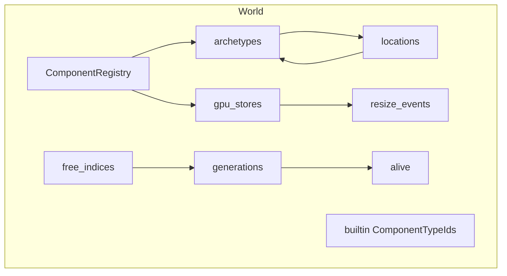
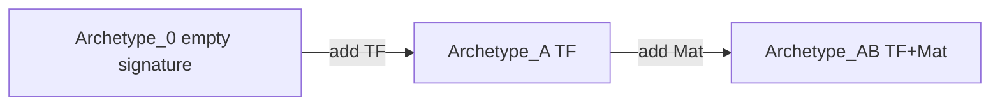
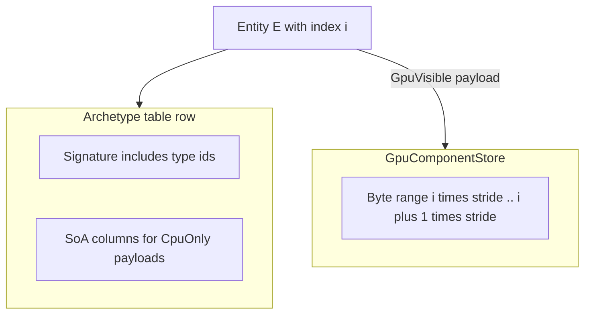
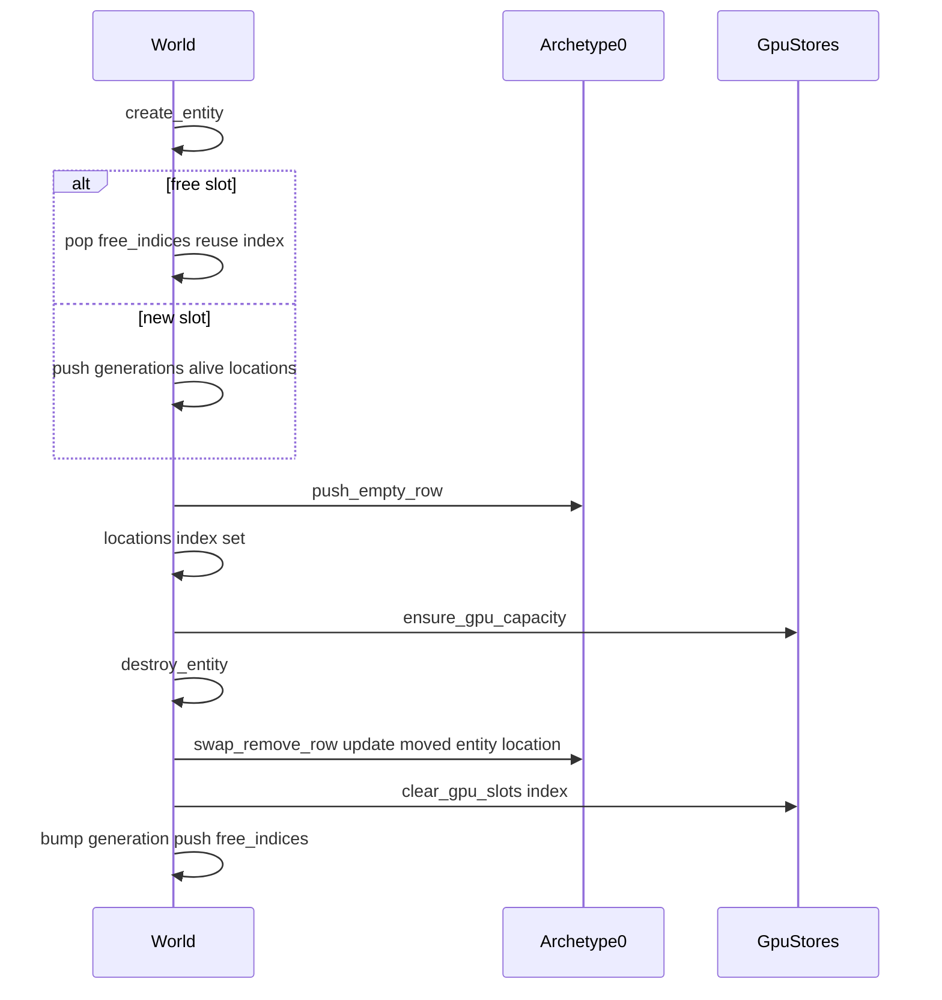
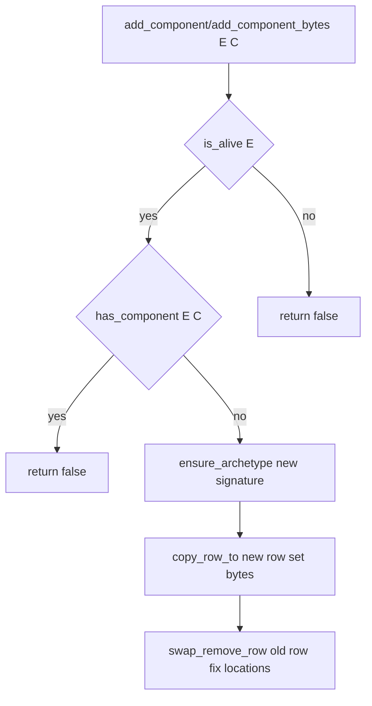
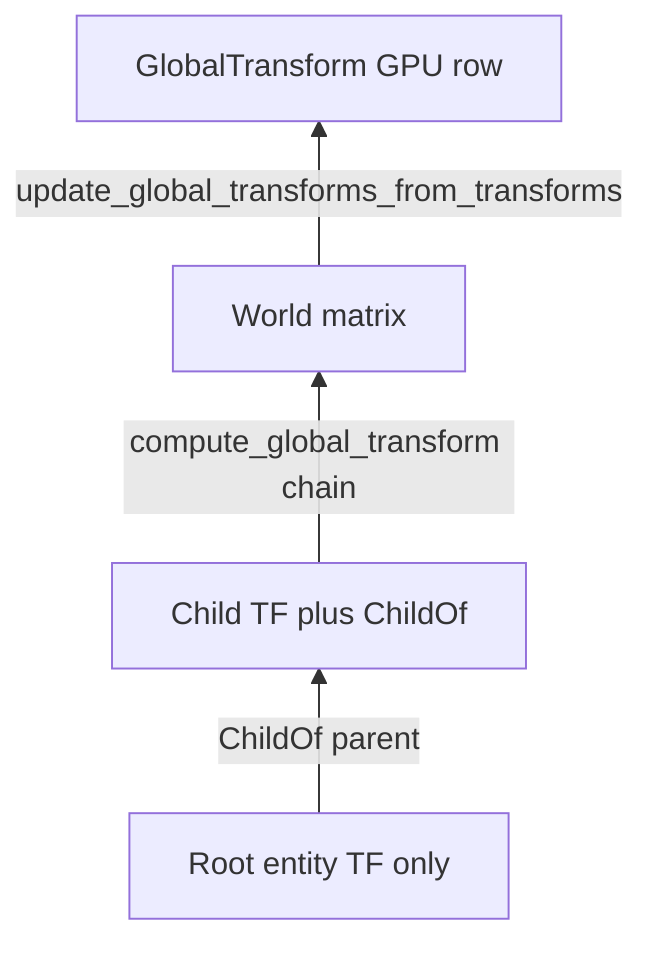

# Rhodonite Core ECS（`emadurandal/rhodonite_core/ecs`）

**言語:** [English](ecs.md)

[`moon/rhodonite_core/src/ecs/`](../moon/rhodonite_core/src/ecs/) は、**アーキタイプ（Archetype）** ベースの ECS 実装です。CPU 側では **SoA（Structure of Arrays）** でキャッシュ効率のよい列走査を行い、WebGPU 向けには **`EntityId.index` をストレージバッファの論理添字として安定利用**できるよう、GPU 可視コンポーネントを **アーキタイプ行から切り離したフラット配列**に載せる二層構造になっています。

外付けの `System` / `Schedule` もありますが、`World` 自体は system を所有しません。行イテレーションは `Query` 経由で公開し、ビルトイン用のヘルパーも同じ内部 iterator の上に実装されています。

公開 API の機械的な一覧は [`pkg.generated.mbti`](../moon/rhodonite_core/src/ecs/pkg.generated.mbti) を参照してください。

---

## 主要な型

| 型 | 役割 |
|----|------|
| `EntityId` | 密な `index`（GPU 添字・配列スロット）と、破棄・再利用で増える `generation`。古いハンドルは `is_alive` で弾かれる。 |
| `ComponentTypeId` | `ComponentRegistry` が登録順に採番する不透明 ID。 |
| `EntityLocation` | 生存エンティティが「どのアーキタイプの何行目」にいるか。 |
| `ComponentKind` | `CpuOnly`（SoA 列に実データ） / `GpuVisible`（シグネチャのみ SoA、実体はフラット `GpuComponentStore`）。 |
| `RegisteredComponent` | 名前、`kind`、`cpu_stride`、任意の `gpu_layout`。 |

---

## `World` の内部構造



- **`generations` / `alive` / `free_indices`**: スロットの再利用と世代管理。
- **`locations`**: `EntityId.index` → `EntityLocation?`（アーキタイプ索引と行）。
- **`archetypes`**: シグネチャごとの SoA テーブル（CPU コンポーネントの実体）。
- **`gpu_stores`**: `ComponentTypeId.index` に並ぶ `GpuComponentStore?`（GPU 可視のみ `Some`）。
- **`resize_events`**: フラットストア拡張時にバッファ再作成が必要な通知のキュー。

---

## アーキタイプと SoA

- 各アーキタイプは **昇順ソートされた `ComponentTypeId` のリスト**をシグネチャとして持ち、同一シグネチャのエンティティが同じテーブルに並びます。
- 新規 `World` では **アーキタイプ 0 が空シグネチャ**で、生成直後のエンティティはそこに入ります（[`world.mbt` の `World::new`](../moon/rhodonite_core/src/ecs/world.mbt)）。
- 各 CPU コンポーネント列は `stride` バイト幅の `bytes` 配列で、行 `row` のオフセットは `row * stride` です。



SoA の「列がコンポーネント、行がエンティティ」のイメージは下図を参照してください。


---

## `CpuOnly` と `GpuVisible` の置き場所



- **CpuOnly**: アーキタイプの SoA 列にバイト列が載る。エンティティがアーキタイプ間を移動すると行インデックスは変わるが、列内のデータは `copy_row_to` で引き継がれる。
- **GpuVisible**: アーキタイプには **型 ID がシグネチャに含まれるだけ**（`cpu_stride == 0`）。実データは常に **`entity.index * stride` 起点のフラット配列**。アーキタイプ行が動いても **GPU スロットは `index` で固定**される。

---

## エンティティのライフサイクル



---

## コンポーネント追加・削除とアーキタイプ移行

`add_component` / `add_component_bytes` / `remove_component` の要点:

1. 既にシグネチャに含まれていれば `false` を返します。既存 CPU payload の更新は `set_component_bytes` を使います。
2. 含まれていなければ **新シグネチャ**用のアーキタイプを `ensure_archetype` で確保。
3. 対象エンティティの **新行**を確保し、`copy_row_to` で重なる列をコピー。
4. `add_component` では zero/default payload、`add_component_bytes` では指定された CPU/GPU payload を反映。
5. **旧行**を `swap_remove_row` で削除。最終行が移動した場合は **`update_moved_location`** でそのエンティティの `locations` を更新。



---

## クエリ API

行イテレーションには `Query::new(required)` と `query.for_each(world, f)` を使います。引数 `required` に列挙した `ComponentTypeId` を **すべて含む**アーキタイプだけを走査します。`required` が空なら何もしません。

callback には `QueryRow` が渡り、payload 配列の添字ではなく component id でアクセスでき、read/write の access check も component ごとに維持されます。

- `required` component set を名前付きの値として再利用できます。
- `Query::new` の時点で重複 component id を拒否できます。
- 入力配列をコピーするため、呼び出し側の配列を後から変更しても query の payload 順は変わりません。
- schedule 実行中は、required の全 component が active System の `reads` または `writes` に含まれる必要があります。
- `QueryRow::read_view(component)` は `CpuOnly` なら SoA row、`GpuVisible` なら GPU flat row のゼロコピー `ArrayView[Byte]` を返します。
- `QueryRow::write_view(component)` はゼロコピー `MutArrayView[Byte]` を返し、schedule 実行中は active System の `writes` にその component が含まれる必要があります。`GpuVisible` component の mutable view を要求した場合、その entity row は直ちに dirty になります。
- イテレーション中に GPU store が拡張すると `resize_events` に `GpuResizeEvent` が積まれることがあります（`needs_full_upload` 等）。

```moonbit
let query = Query::new([tf, gt])
query.for_each(world, fn(row) {
  let tf_bytes = row.read_view(tf)
  let global_tf = @comp.GlobalTransform::view_std140_gpu_row(row.write_view(gt))
  ignore(tf_bytes)
  ignore(global_tf)
})
```

---

## CommandBuffer

`create_entity`、`destroy_entity`、`add_component`、`add_component_bytes`、`remove_component`、`set_component_bytes`、`clear_gpu_component` などの World 変更 API は、query 走査中には guard されます。query callback から直接呼ぶと、アーキタイプ行や mutable payload view を壊す可能性があるため abort します。

query / system の走査中に変更を要求したい場合は、System に渡される `CommandBuffer` に積みます。

```moonbit
let system = System::new_with_structural_write(
  "replace-component",
  Update,
  [],
  [old_component, new_component],
  fn(world, _ctx, commands) {
    query.for_each(world, fn(row) {
      let spawned = commands.create_entity()
      commands.remove_component(row.entity(), old_component)
      commands.add_component_bytes(row.entity(), new_component, bytes)
      commands.add_component_bytes(spawned, new_component, spawn_bytes)
    })
  },
)
```

`Schedule::run` は System ごとに command buffer を作り、積まれた command をその System の `writes` / `structural_write` 宣言に照らして検査し、System が戻った直後に積まれた順で適用します。`commands.create_entity()` は queue 時点で `EntityId` を予約して返します。予約 entity は apply まで alive ではありませんが、同じ buffer の後続 command で component を追加できます。

---

## System と Schedule

`World` は system を所有しません。最初の system 層は、`World` の外側に置く `Schedule` と、関数型の `System` です。

```moonbit
let schedule = Schedule::new()
schedule.add_system(System::new_with_structural_write("RemoveExpired", Update, [lifetime], [], fn(world, ctx, commands) {
  let query = Query::new([lifetime])
  query.for_each(world, fn(row) {
    let remaining = @comp.get_gpu_f32_byte_view(row.read_view(lifetime), 0)
    if remaining <= ctx.delta_seconds {
      commands.destroy_entity(row.entity())
    }
  })
}))
let _ = schedule.run(world, SystemContext::new(0.016, frame_index))
```

`Schedule::run` は単一スレッドで動きます。phase は `PreUpdate`、`Update`、`PostUpdate`、`PreRender`、`RenderExtract` の順に実行されます。同じ phase の system は登録順です。各 system には新しい `CommandBuffer` が渡され、system が返った直後に schedule が適用します。そのため、後続 system は前の system の構造変更を観測できます。

`Schedule::run` は system 実行中だけ component 登録を一時的に閉じ、return 前に再び開きます。`World::component_registration_locked()` で状態を確認できます。

`System::reads` と `System::writes` は scheduling 改善に向けたメタデータです。構築時に重複を検査し、配列をコピーします。`System::conflicts_with(other)` は write/write、write/read、read/write の重なりを検出し、`Schedule::has_parallel_access_conflicts()` は同じ phase の system 間に並列実行できないアクセス衝突があるかを返します。`Schedule::run` 自体は引き続き単一スレッド・登録順実行です。

ビルトインの変換更新は `transform_propagation_system(world)` でも登録できます。この system は `World::update_global_transforms_from_transforms` と同じ処理を `PostUpdate` phase で実行し、`Transform3D` / `ChildOf` を read、`GlobalTransform` を write として宣言します。

---

## GPU アップロードとリサイズ

- **`drain_gpu_writes(component)`**: 当該コンポーネントのストアで dirty になった **エンティティインデックス**をソートし、連続区間をマージして `GpuWrite`（`byte_offset` + `bytes`）の配列にします。WebGPU 側では `write_buffer_from_fixed_array` 等にそのまま渡せます。
- **`drain_resize_events`**: バッキング配列が伸びた際の通知。呼び出し側で **GPU バッファを再作成**し、必要なら **フルアップロード**する想定です。`Schedule::run` 中は World 所有の event queue を消費する操作として `structural_write` が必要です。Schedule 外では直接呼べます。

`add_component`、`add_component_bytes`、`component_bytes`、`set_component_bytes` は CPU-only / GPU-visible component の両方を扱います。CPU-only payload は archetype SoA row、GPU-visible payload は `EntityId.index` ベースの flat GPU row に置かれます。GPU store の capacity 拡張と `GpuResizeEvent` 生成は `World` 内部の共通経路を通ります。

実サンプル: [`ecs-scene-graph` の `render_frame`](../moon/rhodonite_examples/src/ecs-scene-graph/common/webgpu_renderer.mbt) で `update_global_transforms_from_transforms` の後に `drain_gpu_writes(global_transform)` し、`queue.write_buffer_from_fixed_array` しています。

---

## ビルトインの 3 コンポーネント

`World::new` 時に次の順で登録されます（`ComponentTypeId.index` は 0, 1, 2）。

| 順序 | 名前 | 種別 | 役割 |
|------|------|------|------|
| 0 | `Transform3D` | CpuOnly | ローカル TRS 等。SoA に保持。`set_transform` / `get_transform`。 |
| 1 | `GlobalTransform` | GpuVisible | ワールド行列（std140 互換レイアウト）。フラット GPU ストア。`set_global_transform` / `get_global_transform`。 |
| 2 | `ChildOf` | CpuOnly | 親 `EntityId` の index/generation。`set_child_of` / `get_child_of`。 |

階層とワールド行列:



- **`compute_global_transform`**: `ChildOf` を親方向に辿り（サイクル・死んだ親は失敗）、各 `Transform3D` を掛け合わせたワールド行列を返します。
- **`update_global_transforms_from_transforms`**: **両方**のビルトイン変換を持つ全エンティティを一括走査します。`QueryRow::write_view` 経由で `GlobalTransform` に書くため、GPU 行は dirty になります。

---

## 独自コンポーネントの登録

- **`World::register_cpu_component(name, cpu_stride)`**: SoA 用のストライドを指定。`gpu_stores` に `None` が追加されます。
- **`World::register_gpu_component(name, gpu_layout)`**: `GpuLayout::is_valid` が必須。ストライドに応じた `GpuComponentStore` が `Some` で追加されます。

component 登録は active な schedule 実行の外で行います。`Schedule::run` 中は一時的に登録できませんが、run が戻った後に新しい component type を登録することはできます。

レイアウト補助は [`moon/rhodonite_core/src/ecs/components/gpu_layout.mbt`](../moon/rhodonite_core/src/ecs/components/gpu_layout.mbt) の `GpuLayout::std140`、`GpuLayout::empty` などを参照してください。

---

## API クックブック（最小）

以下は **インポートや型エイリアスを省略した概略**です。実際のパッケージでは `@ecs` や `@matrix44` などを `moon.pkg` に追加してください。

```moonbit
// 世界とエンティティ
let world = World::new()
let e = world.create_entity()

// ビルトイン
ignore(world.set_transform_trs(e, 0.0, 0.0, 0.0, 0.0, 0.0, 0.0, 1.0, 1.0, 1.0, 1.0))
ignore(world.set_global_transform(e, Matrix44F::identity()))

// 任意 CPU コンポーネント
let tag = world.register_cpu_component("Tag", 4)
ignore(world.add_component_bytes(e, tag, tag_bytes))

// クエリ（例: TF + GT を同時に見る）
let required = [world.transform_component(), world.global_transform_component()]
let query = Query::new(required)
query.for_each(world, fn(row) {
  let tf_row = row.read_view(world.transform_component())
  let gt_row = row.write_view(world.global_transform_component())
  ...
})

// フレーム末: GPU 差分アップロード
let gt = world.global_transform_component()
let writes = world.drain_gpu_writes(gt)
// queue.write_buffer_from_fixed_array(buffer, w.byte_offset, w.bytes)
```

---

## テストと実装へのリンク

挙動の固定には [`moon/rhodonite_core/src/ecs/ecs_test.mbt`](../moon/rhodonite_core/src/ecs/ecs_test.mbt) が参照になります（アーキタイプ移行、世代再利用、`drain_gpu_writes` の連続マージ、std140 パディングなど）。

コア実装ファイル:

- [`types.mbt`](../moon/rhodonite_core/src/ecs/types.mbt) — データ構造定義
- [`world.mbt`](../moon/rhodonite_core/src/ecs/world.mbt) — エンティティ、アーキタイプ、クエリ
- [`archetype.mbt`](../moon/rhodonite_core/src/ecs/archetype.mbt) — SoA / swap-remove
- [`registry.mbt`](../moon/rhodonite_core/src/ecs/registry.mbt) — 登録
- [`gpu_store.mbt`](../moon/rhodonite_core/src/ecs/gpu_store.mbt) — フラットストアと dirty
- [`world_transform3d.mbt`](../moon/rhodonite_core/src/ecs/world_transform3d.mbt) / [`world_global_transform.mbt`](../moon/rhodonite_core/src/ecs/world_global_transform.mbt) / [`world_child_of.mbt`](../moon/rhodonite_core/src/ecs/world_child_of.mbt) — ビルトイン API
