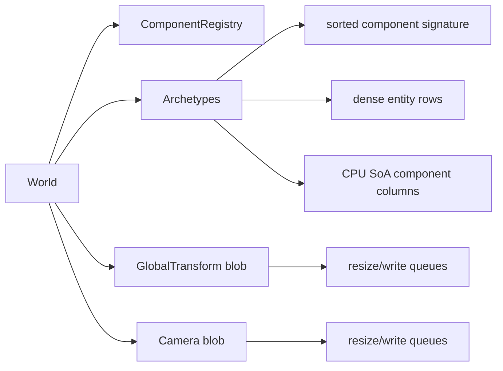

# ECS

[`moon/rhodonite_core/src/ecs/`](../moon/rhodonite_core/src/ecs/) は archetype ベースの ECS です。component は CPU-only で、payload bytes は archetype の SoA column に置かれます。component の所有関係は archetype signature で表します。

GPU upload 用の bytes は任意の ECS component store では扱いません。builtin の `GlobalTransform` と `Camera` だけが CPU row に小さな ref を持ち、matrix payload は専用の packed GPU blob store に書き込みます。

## 主な型

| 型 | 役割 |
|----|------|
| `EntityId` | 安定した entity index と generation。destroy/reuse 後の古い handle を拒否する。 |
| `ComponentTypeId` | registry と archetype signature に使う component id。 |
| `RegisteredComponent` | id、name、CPU SoA row stride を持つ component metadata。 |
| `Archetype` | 同じ sorted component signature を持つ entity の dense table。 |
| `ComponentColumn` | 1 component type 分の packed byte column。 |
| `Query` / `RawQuery` | row 単位の高級 iteration と archetype column 単位の expert iteration。 |
| `GpuWriteView` | builtin packed blob store が返す借用 upload slice。 |
| `PackedGpuBlobResizeEvent` | builtin packed GPU blob の resize event。 |

## Storage Model



- user 登録の ECS component はすべて CPU SoA component です。
- `World::register_cpu_component(name, cpu_stride)` は component を登録し、component-to-archetype index 用の slot を追加します。
- `add_component`、`add_component_bytes`、`remove_component`、`set_component_bytes`、`component_bytes` は archetype SoA row だけを扱います。
- entity が archetype 間を移動すると、重複する CPU column は `copy_row_to` でコピーされます。row index は変わりますが、`EntityId` は安定しています。
- `GlobalTransform` と `Camera` は CPU ref component です。GPU matrix bytes は `GlobalTransformBlobStore` / `CameraBlobStore` に置きます。
- 低レベルの GlobalTransform fp16 helper として、f32 値を little-endian の packed fp16 lane へ書く `global_transform_put_f16_le_mut_view` があります。byte store を手書きせずに使います。

## Builtin Component

| Index | Component | Storage | Notes |
|-------|-----------|---------|-------|
| 0 | `Transform3D` | CPU SoA | local TRS。`set_transform` / `get_transform`。 |
| 1 | `GlobalTransform` | CPU SoA ref + packed blob | CPU row は `{ format, word_offset }`。matrix bytes は GlobalTransform blob。 |
| 2 | `ChildOf` | CPU SoA | parent `EntityId` の index/generation。 |
| 3 | `Camera` | CPU SoA ref + packed blob | CPU row は `{ word_offset }`。camera bytes は Camera blob。 |

## Query

`Query::new(required)` は `QueryRow` を返します。`QueryRow::read(component, f)` / `write(component, f)` は closure の中だけ CPU row bytes を貸し出します。

`RawQuery::for_each_archetype` は `RawQueryArchetype` chunk を返します。`read_column` / `write_column` は matched archetype の logical column view を `row_count * stride` サイズで返します。

query は duplicate required component を拒否します。query callback 中は、archetype row や borrowed view を壊さないように、構造変更や直接 payload setter が guard されます。

## Mutation And Scheduling

`Schedule` は固定 lifecycle を持たず、外部から与えられる文字列名付き `PhaseKey` と phase order に従って実行されます。facade runtime では `PhaseGroupKey` が driver ごとの phase order を束ねます。`Schedule::run` / `Schedule::run_phase` 中の `World` mutation API は `System` の access 宣言で guard されます。

| Operation | Required declaration |
|-----------|----------------------|
| `has_component`, `component_bytes`, query prepare/iteration | `reads` または `writes` |
| `set_component_bytes`, query row writes | `writes` |
| `create_entity`, `destroy_entity`, `add_component*`, `remove_component`, `spawn_batch` | `structural_write` と対象 component の `writes` |
| builtin blob resize event drains | `structural_write` |

system 内で query 中に構造変更したい場合は `CommandBuffer` に queue し、callback 終了後に適用します。

## Builtin GPU Blob Upload

汎用 ECS component は GPU upload queue を持ちません。render extraction では builtin blob API を使います。

- `drain_global_transform_blob_write_views`
- `drain_global_transform_blob_resize_events`
- `drain_camera_blob_write_views`
- `drain_camera_blob_resize_events`
- `write_global_transform_blob_range_views`
- `write_global_transform_blob_range_by_refs`

返される `GpuWriteView` は packed blob の backing storage を借用します。同じ blob を次に変更する前に upload まで使い切る前提です。

## TypeScript Wrapper

[`moon/rhodonite_core/src/ecs/ts/`](../moon/rhodonite_core/src/ecs/ts/) の wrapper も CPU-only ECS surface に揃えています。

- `World.registerCpuComponent`
- `World.addComponent*`, `setComponentBytes`, `componentBytesCopy`
- `Query`, `RawQuery`, `SpawnBatchRow`
- `drainGlobalTransformBlobWriteViews` などの builtin blob upload helper

`GpuLayout` は builtin row format や renderer code 向けの layout/packing helper として残りますが、ECS component storage 登録には使いません。

## Validation

挙動は [`ecs_test.mbt`](../moon/rhodonite_core/src/ecs/ecs_test.mbt) と [`world.test.ts`](../moon/rhodonite_core/src/ecs/ts/world.test.ts) で固定しています。

```bash
moon check --target all
pnpm run test:core:mbt
pnpm run test:core:js
```
