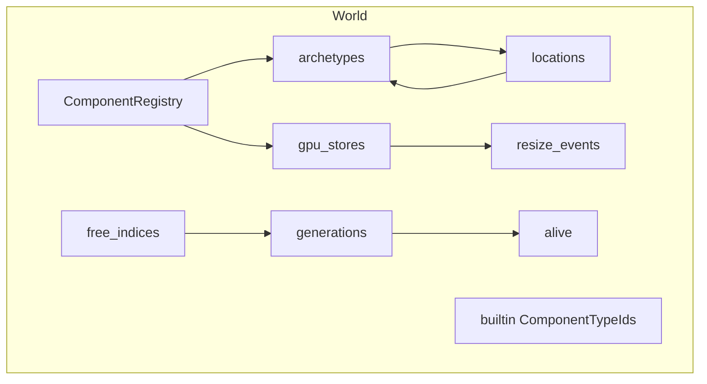
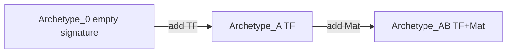
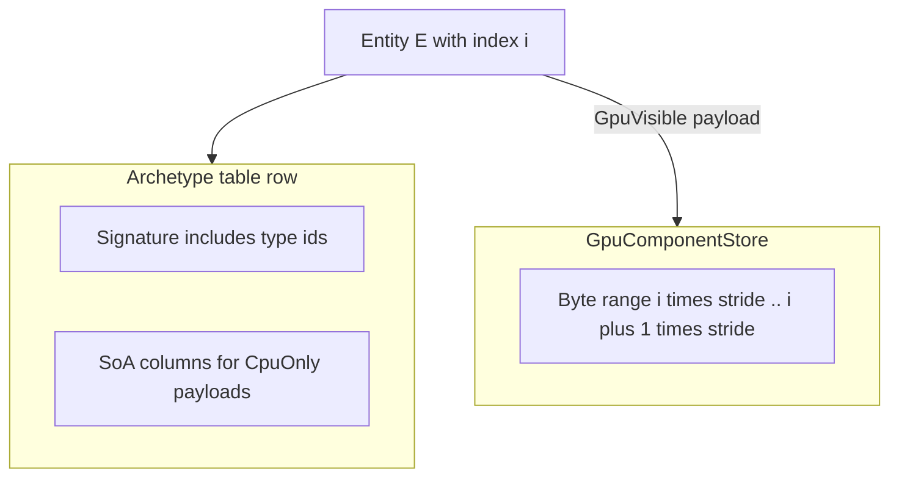
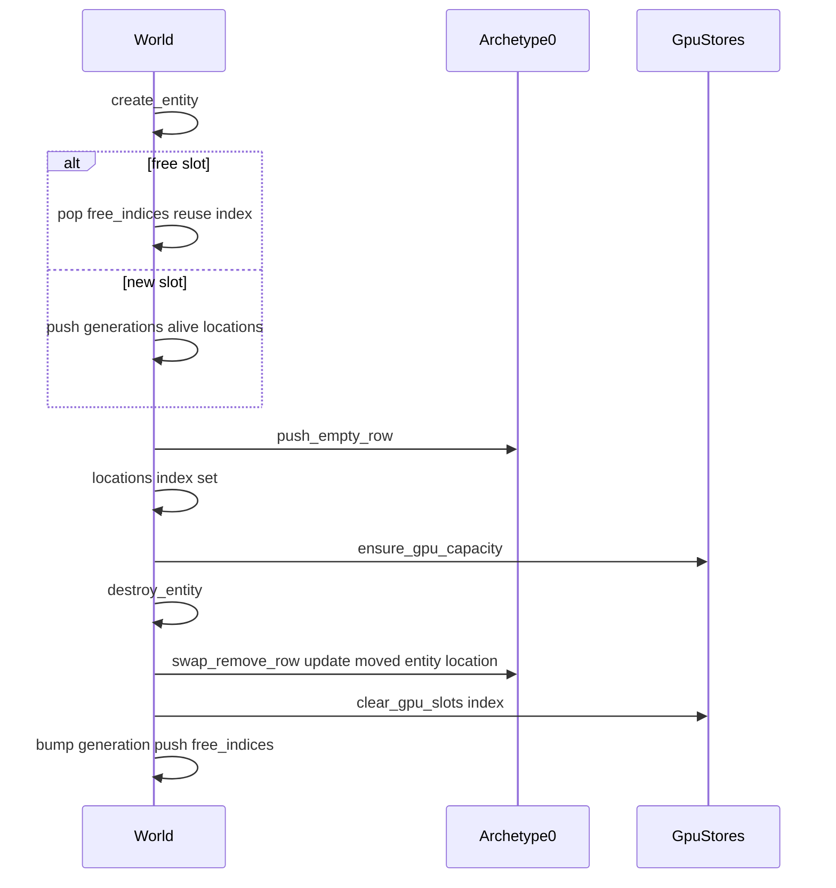
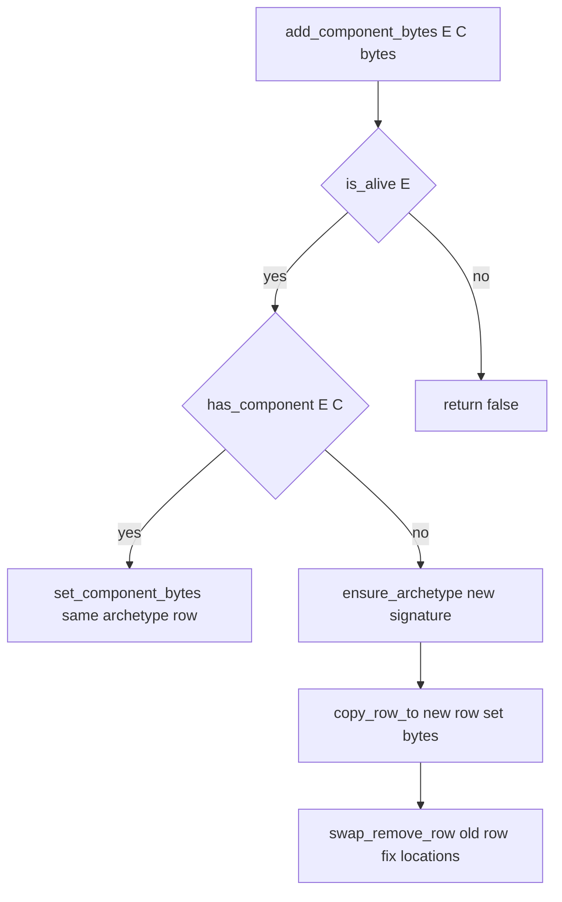
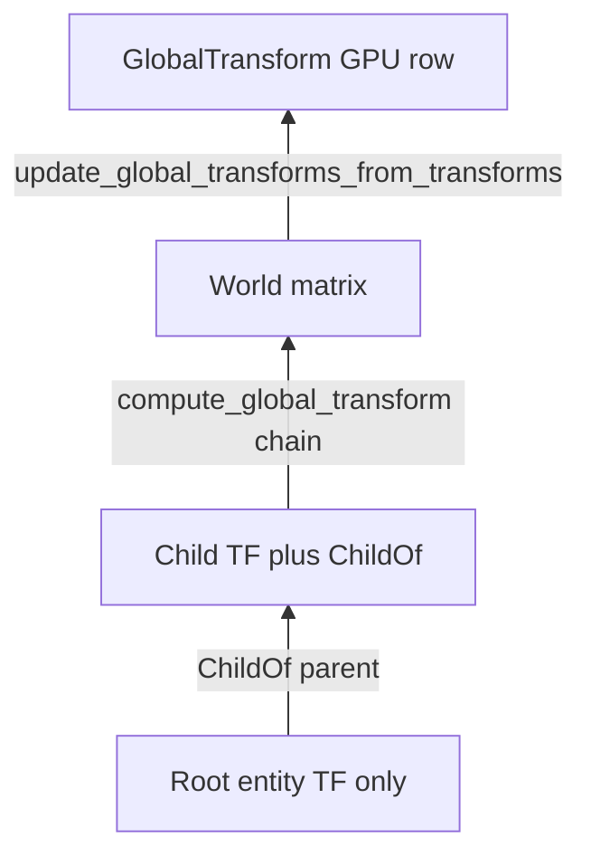

# Rhodonite Core ECS（`emadurandal/rhodonite_core/ecs`）

**言語:** [English](ecs.md)

[`moon/rhodonite_core/src/ecs/`](../moon/rhodonite_core/src/ecs/) は、**アーキタイプ（Archetype）** ベースの ECS 実装です。CPU 側では **SoA（Structure of Arrays）** でキャッシュ効率のよい列走査を行い、WebGPU 向けには **`EntityId.index` をストレージバッファの論理添字として安定利用**できるよう、GPU 可視コンポーネントを **アーキタイプ行から切り離したフラット配列**に載せる二層構造になっています。

「`System` 型」はありません。クエリと更新は `World` のメソッド（特に `for_each_entity_with_components`）と、ビルトイン用のヘルパーで行います。

公開 API の機械的な一覧は [`pkg.generated.mbti`](../moon/rhodonite_core/src/ecs/pkg.generated.mbti) を参照してください。

---

## 主要な型

| 型 | 役割 |
|----|------|
| `EntityId` | 密な `index`（GPU 添字・配列スロット）と、破棄・再利用で増える `generation`。古いハンドルは `is_alive` で弾かれる。 |
| `ComponentTypeId` | `ComponentRegistry` が登録順に採番する不透明 ID。 |
| `EntityLocation` | 生存エンティティが「どのアーキタイプの何行目」にいるか。 |
| `ComponentKind` | `CpuOnly`（SoA 列に実データ） / `GpuVisible`（シグネチャのみ SoA、実体はフラット `GpuComponentStore`）。 |
| `RegisteredComponent` | 名前、`kind`、`cpu_stride`、任意の `gpu_layout`。 |

---

## `World` の内部構造



- **`generations` / `alive` / `free_indices`**: スロットの再利用と世代管理。
- **`locations`**: `EntityId.index` → `EntityLocation?`（アーキタイプ索引と行）。
- **`archetypes`**: シグネチャごとの SoA テーブル（CPU コンポーネントの実体）。
- **`gpu_stores`**: `ComponentTypeId.index` に並ぶ `GpuComponentStore?`（GPU 可視のみ `Some`）。
- **`resize_events`**: フラットストア拡張時にバッファ再作成が必要な通知のキュー。

---

## アーキタイプと SoA

- 各アーキタイプは **昇順ソートされた `ComponentTypeId` のリスト**をシグネチャとして持ち、同一シグネチャのエンティティが同じテーブルに並びます。
- 新規 `World` では **アーキタイプ 0 が空シグネチャ**で、生成直後のエンティティはそこに入ります（[`world.mbt` の `World::new`](../moon/rhodonite_core/src/ecs/world.mbt)）。
- 各 CPU コンポーネント列は `stride` バイト幅の `bytes` 配列で、行 `row` のオフセットは `row * stride` です。



SoA の「列がコンポーネント、行がエンティティ」のイメージは下図を参照してください。


---

## `CpuOnly` と `GpuVisible` の置き場所



- **CpuOnly**: アーキタイプの SoA 列にバイト列が載る。エンティティがアーキタイプ間を移動すると行インデックスは変わるが、列内のデータは `copy_row_to` で引き継がれる。
- **GpuVisible**: アーキタイプには **型 ID がシグネチャに含まれるだけ**（`cpu_stride == 0`）。実データは常に **`entity.index * stride` 起点のフラット配列**。アーキタイプ行が動いても **GPU スロットは `index` で固定**される。

---

## エンティティのライフサイクル



---

## コンポーネント追加・削除とアーキタイプ移行

`add_component_bytes` / `remove_component` の要点:

1. 既にシグネチャに含まれていれば **同一アーキタイプ内でバイトを上書き**するだけ。
2. 含まれていなければ **新シグネチャ**用のアーキタイプを `ensure_archetype` で確保。
3. 対象エンティティの **新行**を確保し、`copy_row_to` で重なる列をコピー。
4. 新行に対する書き込み（追加時）を反映。
5. **旧行**を `swap_remove_row` で削除。最終行が移動した場合は **`update_moved_location`** でそのエンティティの `locations` を更新。



---

## クエリ: `for_each_entity_with_components`

- 引数 `required` に列挙した `ComponentTypeId` を **すべて含む**アーキタイプだけを走査します。`required` が空なら何もしません。
- コールバックには `(entity, full_signature, payloads)` が渡り、`payloads[k]` は `required[k]` に対応する **`MutArrayView[Byte]`** です。
  - **CpuOnly**: そのアーキタイプ行の SoA 列ビュー。
  - **GpuVisible**: **フラット `GpuComponentStore`** の `entity.index` スロットのビュー（アーキタイプ SoA ではない）。
- コールバック内で **GpuVisible のバイトを直接変更**した場合、**自動では dirty になりません**。`World::mark_gpu_component_dirty` を呼び、`drain_gpu_writes` でアップロード対象に含めてください。
- コールバックが特定の GPU-visible コンポーネントを必ず書く場合は、`World::for_each_entity_with_components_marking_gpu_dirty(required, dirty_gpu_components, f)` を使うと、各 callback 後に対象行を dirty にできます。
- イテレーション中にストアが拡張すると `resize_events` に `GpuResizeEvent` が積まれることがあります（`needs_full_upload` 等）。

アーキタイプの full signature が不要な System 風コードでは、`Query::new(required)` と `query.for_each(world, f)` を使えます。`World::for_each_entity_with_components` を直接呼ぶ場合と比べると、`Query` には次の実用上のメリットがあります。

- `required` component set を名前付きの値として再利用できます。
- `Query::new` の時点で重複 component id を拒否できます。
- 入力配列をコピーするため、呼び出し側の配列を後から変更しても query の payload 順は変わりません。
- callback から `full_signature` を省けるため、通常の System 処理を短く書けます。
- GPU-visible 行を必ず書く callback には `query.for_each_marking_gpu_dirty(world, dirty_gpu_components, f)` を組み合わせられます。

callback が full archetype signature を必要とする場合や、GPU dirty 化するかどうかを entity ごとに細かく判断したい場合は、低レベルの `World::for_each_entity_with_components` を直接使います。

---

## CommandBuffer

`create_entity`、`destroy_entity`、`add_component_bytes`、`remove_component`、`set_gpu_component_bytes`、`clear_gpu_component` などの構造変更 API は、query 走査中には guard されます。query callback から直接呼ぶと、アーキタイプ行や mutable payload view を壊す可能性があるため abort します。

query / system の走査中に変更を要求したい場合は、`CommandBuffer` に積みます。

```moonbit
let commands = CommandBuffer::new()
query.for_each(world, fn(entity, _payloads) {
  commands.remove_component(entity, old_component)
  commands.add_component_bytes(entity, new_component, bytes)
})
let _ = commands.apply(world)
```

command は query 終了後に、積まれた順で適用されます。`CommandBuffer::apply` は buffer を空にし、失敗した command があれば `false` を返しますが、後続 command の適用は続けます。entity 生成はまだ含めていません。query 走査外では `World::create_entity` を直接使います。

---

## GPU アップロードとリサイズ

- **`drain_gpu_writes(component)`**: 当該コンポーネントのストアで dirty になった **エンティティインデックス**をソートし、連続区間をマージして `GpuWrite`（`byte_offset` + `bytes`）の配列にします。WebGPU 側では `write_buffer_from_fixed_array` 等にそのまま渡せます。
- **`drain_resize_events`**: バッキング配列が伸びた際の通知。呼び出し側で **GPU バッファを再作成**し、必要なら **フルアップロード**する想定です。

実サンプル: [`ecs-scene-graph` の `render_frame`](../moon/rhodonite_examples/src/ecs-scene-graph/common/webgpu_renderer.mbt) で `update_global_transforms_from_transforms` の後に `drain_gpu_writes(global_transform)` し、`queue.write_buffer_from_fixed_array` しています。

---

## ビルトインの 3 コンポーネント

`World::new` 時に次の順で登録されます（`ComponentTypeId.index` は 0, 1, 2）。

| 順序 | 名前 | 種別 | 役割 |
|------|------|------|------|
| 0 | `Transform3D` | CpuOnly | ローカル TRS 等。SoA に保持。`set_transform` / `get_transform`。 |
| 1 | `GlobalTransform` | GpuVisible | ワールド行列（std140 互換レイアウト）。フラット GPU ストア。`set_global_transform` / `get_global_transform`。 |
| 2 | `ChildOf` | CpuOnly | 親 `EntityId` の index/generation。`set_child_of` / `get_child_of`。 |

階層とワールド行列:



- **`compute_global_transform`**: `ChildOf` を親方向に辿り（サイクル・死んだ親は失敗）、各 `Transform3D` を掛け合わせたワールド行列を返します。
- **`update_global_transforms_from_transforms`**: **両方**のビルトイン変換を持つ全エンティティを一括走査し、`GlobalTransform` の GPU 行を更新し、変更があった行は `mark_gpu_component_dirty` します。

---

## 独自コンポーネントの登録

- **`World::register_cpu_component(name, cpu_stride)`**: SoA 用のストライドを指定。`gpu_stores` に `None` が追加されます。
- **`World::register_gpu_component(name, gpu_layout)`**: `GpuLayout::is_valid` が必須。ストライドに応じた `GpuComponentStore` が `Some` で追加されます。

レイアウト補助は [`moon/rhodonite_core/src/ecs/components/gpu_layout.mbt`](../moon/rhodonite_core/src/ecs/components/gpu_layout.mbt) の `GpuLayout::std140`、`GpuLayout::empty` などを参照してください。

---

## API クックブック（最小）

以下は **インポートや型エイリアスを省略した概略**です。実際のパッケージでは `@ecs` や `@matrix44` などを `moon.pkg` に追加してください。

```moonbit
// 世界とエンティティ
let world = World::new()
let e = world.create_entity()

// ビルトイン
ignore(world.set_transform_trs(e, 0.0, 0.0, 0.0, 0.0, 0.0, 0.0, 1.0, 1.0, 1.0, 1.0))
ignore(world.set_global_transform(e, Matrix44F::identity()))

// 任意 CPU コンポーネント
let tag = world.register_cpu_component("Tag", 4)
ignore(world.add_component_bytes(e, tag, tag_bytes))

// クエリ（例: TF + GT を同時に見る）
let required = [world.transform_component(), world.global_transform_component()]
world.for_each_entity_with_components(required, fn(entity, sig, views) {
  // views[0] = Transform SoA 行, views[1] = GlobalTransform フラット GPU 行
  ...
})

// フレーム末: GPU 差分アップロード
let gt = world.global_transform_component()
let writes = world.drain_gpu_writes(gt)
// queue.write_buffer_from_fixed_array(buffer, w.byte_offset, w.bytes)
```

---

## テストと実装へのリンク

挙動の固定には [`moon/rhodonite_core/src/ecs/ecs_test.mbt`](../moon/rhodonite_core/src/ecs/ecs_test.mbt) が参照になります（アーキタイプ移行、世代再利用、`drain_gpu_writes` の連続マージ、std140 パディングなど）。

コア実装ファイル:

- [`types.mbt`](../moon/rhodonite_core/src/ecs/types.mbt) — データ構造定義
- [`world.mbt`](../moon/rhodonite_core/src/ecs/world.mbt) — エンティティ、アーキタイプ、クエリ
- [`archetype.mbt`](../moon/rhodonite_core/src/ecs/archetype.mbt) — SoA / swap-remove
- [`registry.mbt`](../moon/rhodonite_core/src/ecs/registry.mbt) — 登録
- [`gpu_store.mbt`](../moon/rhodonite_core/src/ecs/gpu_store.mbt) — フラットストアと dirty
- [`world_transform3d.mbt`](../moon/rhodonite_core/src/ecs/world_transform3d.mbt) / [`world_global_transform.mbt`](../moon/rhodonite_core/src/ecs/world_global_transform.mbt) / [`world_child_of.mbt`](../moon/rhodonite_core/src/ecs/world_child_of.mbt) — ビルトイン API
