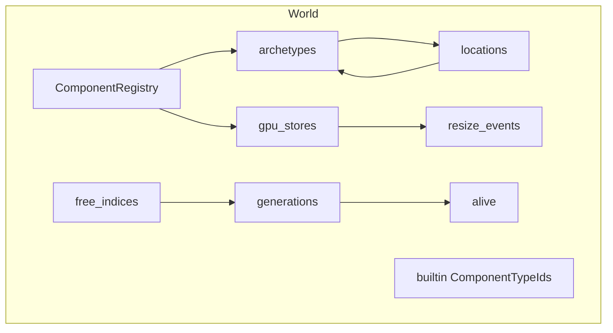
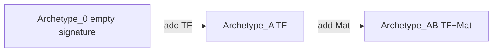
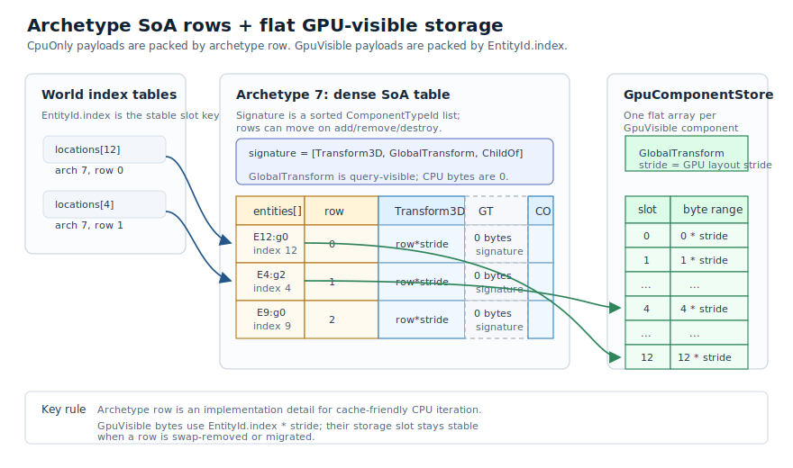
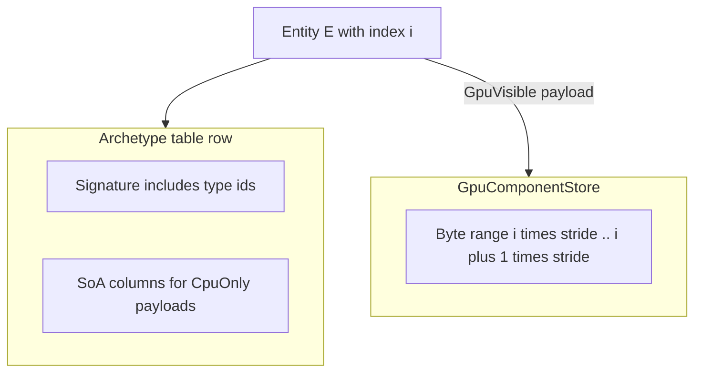
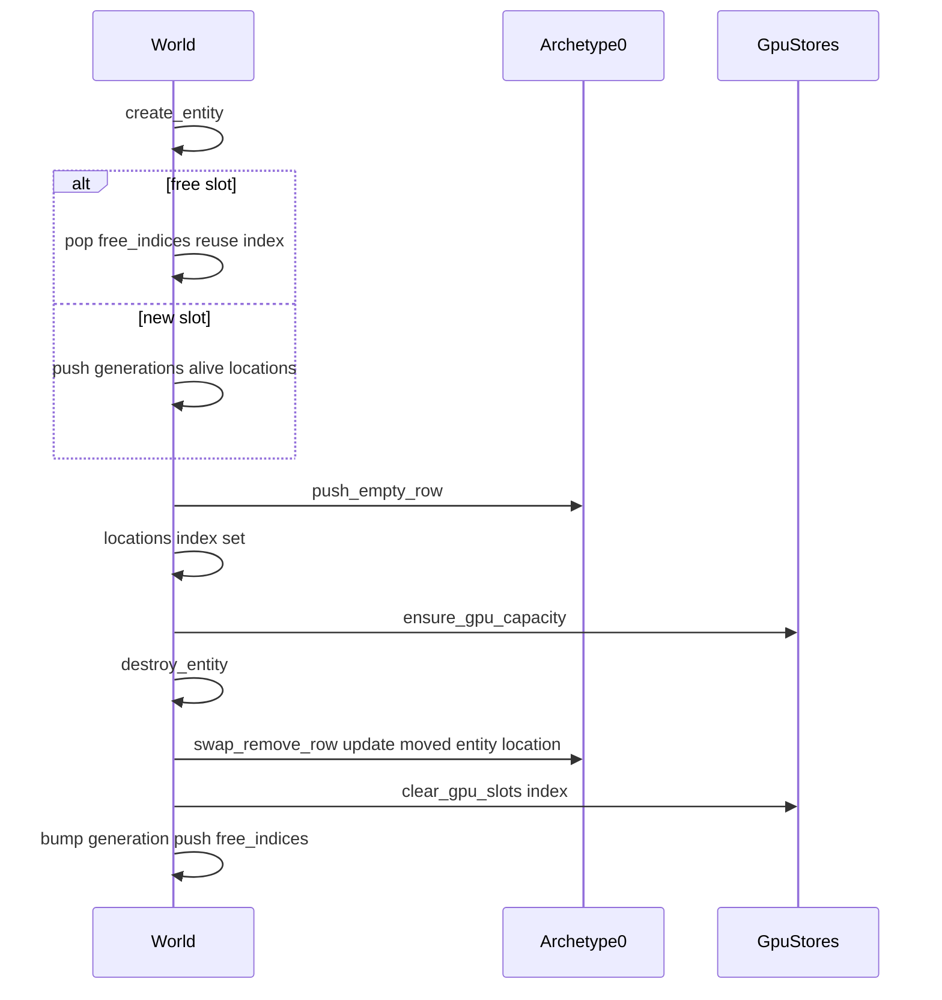
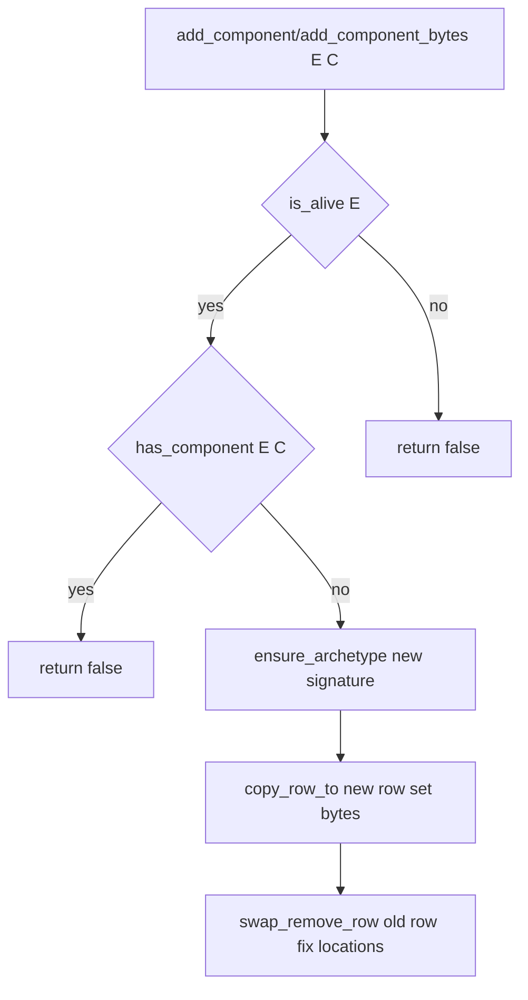
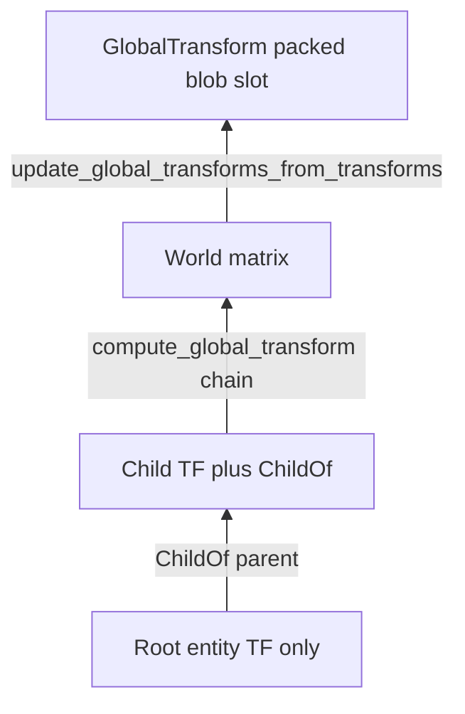

# Rhodonite Core ECS（`emadurandal/rhodonite_core/ecs`）

**言語:** [English](ecs.md)

[`moon/rhodonite_core/src/ecs/`](../moon/rhodonite_core/src/ecs/) は、**アーキタイプ（Archetype）** ベースの ECS 実装です。CPU 側では **SoA（Structure of Arrays）** でキャッシュ効率のよい列走査を行い、WebGPU 向けには **`EntityId.index` をストレージバッファの論理添字として安定利用**できるよう、GPU 可視コンポーネントを **アーキタイプ行から切り離したフラット配列**に載せる二層構造になっています。

外付けの `System` / `Schedule` もありますが、`World` 自体は system を所有しません。行イテレーションは `Query` 経由で公開し、ビルトイン用のヘルパーも同じ内部 iterator の上に実装されています。

公開 API の機械的な一覧は [`pkg.generated.mbti`](../moon/rhodonite_core/src/ecs/pkg.generated.mbti) を参照してください。

---

## 主要な型

| 型 | 役割 |
|----|------|
| `EntityId` | 密な `index`（GPU 添字・配列スロット）と、破棄・再利用で増える `generation`。古いハンドルは `is_alive` で弾かれる。 |
| `ComponentTypeId` | `ComponentRegistry` が登録順に採番する不透明 ID。 |
| `EntityLocation` | 生存エンティティが「どのアーキタイプの何行目」にいるか。 |
| `ComponentKind` | `CpuOnly`（SoA 列に実データ） / `GpuVisible`（シグネチャのみ SoA、実体はフラット `GpuComponentStore`）。 |
| `RegisteredComponent` | 名前、`kind`、`cpu_stride`、任意の `gpu_layout`。 |
| `GpuWrite` | 所有型の GPU upload slice（`byte_offset` + `FixedArray[Byte]`）。所有 payload が必要な API 向け。 |
| `GpuWriteView` | 借用型の GPU upload slice（`byte_offset` + `ArrayView[Byte]`）。即時 upload する zero-copy 寄りの経路向け。 |

---

## `World` の内部構造



- **`generations` / `alive` / `free_indices`**: スロットの再利用と世代管理。
- **`locations`**: `EntityId.index` → `EntityLocation?`（アーキタイプ索引と行）。
- **`archetypes`**: シグネチャごとの SoA テーブル（CPU コンポーネントの実体）。各列は論理行数とは別に `row_capacity` を持ち、append 時に backing を余裕を持って伸ばしても query の列 view には未使用領域を見せません。
- **`archetype_signature_cache` / `component_archetypes`**: storage / query planning 用の内部 index。シグネチャ lookup は構造変更時の全 archetype 走査を避け、component-to-archetype list は query planning を全 archetype ではなく最も候補が少ない required component から始めます。
- **`gpu_stores`**: `ComponentTypeId.index` に並ぶ `GpuComponentStore?`（GPU 可視のみ `Some`）。flat payload bytes、行単位 dirty flag、bulk path 用 dirty range、所有中 row の packed active index set を持ちます。
- **`resize_events`**: フラットストア拡張時にバッファ再作成が必要な通知のキュー。

---

## アーキタイプと SoA

- 各アーキタイプは **昇順ソートされた `ComponentTypeId` のリスト**をシグネチャとして持ち、同一シグネチャのエンティティが同じテーブルに並びます。
- 新規 `World` では **アーキタイプ 0 が空シグネチャ**で、生成直後のエンティティはそこに入ります（[`world.mbt` の `World::new`](../moon/rhodonite_core/src/ecs/world.mbt)）。
- 各 CPU コンポーネント列は `stride` バイト幅の `bytes` 配列で、行 `row` のオフセットは `row * stride` です。
- 列の backing capacity は生存行数より大きい場合があります。公開 API の `RawQueryArchetype::read_column` / `write_column` は `entities.length() * stride` 分の論理バイトだけを返します。



SoA の「列がコンポーネント、行がエンティティ」のイメージは下図を参照してください。



---

## `CpuOnly` と `GpuVisible` の置き場所



- **CpuOnly**: アーキタイプの SoA 列にバイト列が載る。エンティティがアーキタイプ間を移動すると行インデックスは変わるが、列内のデータは `copy_row_to` で引き継がれる。
- **GpuVisible**: アーキタイプには **型 ID がシグネチャに含まれるだけ**（`cpu_stride == 0`）。実データは常に **`entity.index * stride` 起点のフラット配列**。アーキタイプ行が動いても **GPU スロットは `index` で固定**される。
- GPU-visible の ownership は packed active index set にも反映されます（`World::gpu_component_active_indices`）。`add_component*` で active 化し、`remove_component` / `destroy_entity` では zero clear して dirty にしたうえで active set から外します。

---

## エンティティのライフサイクル



### ビルトイン Transform の bulk spawn

`Transform3D` + `GlobalTransform` のビルトイン組を大量生成する場合は `World::spawn_transform_global_batch(count, write)` を使えます。

この API は、通常の

1. 空アーキタイプに spawn、
2. `Transform3D` 追加で migration、
3. `GlobalTransform` ownership 追加でもう一度 migration、

という流れを避け、最初から `[Transform3D, GlobalTransform]` アーキタイプへ直接行を追加します。

callback には direct row view が渡されます。

```moonbit
let entities = world.spawn_transform_global_batch(count, fn(i, entity, tf_row, _gt_row) {
  @comp.Transform3D::write_trs_to_component_mut_view(
    tf_row,
    px,
    py,
    pz,
    0.0,
    0.0,
    0.0,
    1.0,
    sx,
    sy,
    sz,
  )
  ignore(i)
  ignore(entity)
})
```

callback は `Transform3D` row を直接初期化します。`GlobalTransform` は `{ format, word_offset }` を持つ 8 byte の CPU row になり、`spawn_transform_global_batch` が entity ごとの identity slot を packed transform blob に確保するため、callback 側で matrix bytes は書きません。

任意の component signature を大量生成する場合は `World::spawn_batch(components, count, write)` を使えます。指定 component set のアーキタイプへ直接 append し、callback には `SpawnBatchRow` が渡ります。

```moonbit
let entities = world.spawn_batch([cpu_component, gpu_component], count, fn(i, entity, row) {
  row.write(cpu_component, fn(cpu) => cpu[0] = i.to_byte())
  row.write(gpu_component, fn(gpu) => gpu[0] = entity.gpu_index().to_byte())
})
```

`GpuVisible` component は entity index slot を active 化し、連続 index の batch なら dirty range としてまとめます。callback 中は row view を借用しているため、通常の query callback と同じく構造変更 API は拒否されます。

---

## コンポーネント追加・削除とアーキタイプ移行

`add_component` / `add_component_bytes` / `remove_component` の要点:

1. 既にシグネチャに含まれていれば `false` を返します。既存 CPU payload の更新は `set_component_bytes` を使います。
2. 含まれていなければ **新シグネチャ**用のアーキタイプを `ensure_archetype` で確保。
3. 対象エンティティの **新行**を確保し、`copy_row_to` で重なる列をコピー。
4. `add_component` では zero/default payload、`add_component_bytes` では指定された CPU/GPU payload を反映。
5. **旧行**を `swap_remove_row` で削除。最終行が移動した場合は **`update_moved_location`** でそのエンティティの `locations` を更新。



---

## Query API（高級）と RawQuery API（低級）

component identity は常に `ComponentTypeId` です。`Component<T>` や codec object のような別の component handle はありません。

高級 API では `Query::new(required)` と `query.for_each(world, f)` を使います。`QueryRow::read(component, f)` / `write(component, f)` は closure の中だけ `ArrayView[Byte]` / `MutArrayView[Byte]` を貸し出します。`CpuOnly` と `GpuVisible` の違いは呼び出し側が意識せず、`GpuVisible` を `write` した場合は dirty が自動で立ちます。

```moonbit
let query = Query::new([tf, gt])
query.for_each(world, fn(row) {
  row.read(tf, fn(tf_bytes) {
    row.write(gt, fn(gt_row) {
      let local = @comp.Transform3D::local_matrix_from_component_view(tf_bytes)
      @comp.matrix44f_write_affine3x4_to_gpu_row(local, gt_row)
    })
  })
})
```

標準 component には typed convenience もあります。これらは少数操作・debug/editor/test 向けで、エンジン内部の大量処理では後述の Raw / bulk path を使います。

```moonbit
query.for_each(world, fn(row) {
  let local = row.read_transform3d().local_matrix()
  row.write_global_transform(fn(gt) => gt.write_matrix(local))
})
```

低級 API では `RawQuery` を使います。`RawQueryRow::read_view` / `write_view`、`RawQueryArchetype::read_column` / `write_column` はゼロコピー view を直接返します。標準 component だけでなくユーザー定義 component にも使えますが、layout、stride、view lifetime、dirty / resize の意味は呼び出し側が守ります。

```moonbit
RawQuery::new([position, velocity]).for_each_archetype(world, fn(chunk) {
  let pos = chunk.write_column(position)
  let vel = chunk.read_column(velocity)
  ignore(pos)
  ignore(vel)
})
```

`Query::prepare` / `RawQuery::prepare` は world の component-to-archetype index で無関係な archetype を飛ばし、構造変更がなければマッチ済み archetype と access metadata を再利用します。非 prepared の `for_each` も同じ plan builder を通ります。

```moonbit
let raw = RawQuery::new([tf])
raw.for_each_archetype(world, fn(chunk) {
  let stride = chunk.component_stride(tf)
  let tf_column = chunk.write_column(tf)
  for row = 0; row < chunk.length(); row = row + 1 {
    let e = chunk.entity(row)
    let base = row * stride
    // tf_column[base .. base + stride] を更新
    ignore(e)
  }
})
```

---

## CommandBuffer

`create_entity`、`destroy_entity`、`add_component`、`add_component_bytes`、`remove_component`、`set_component_bytes`、`clear_gpu_component` などの World 変更 API は、query 走査中には guard されます。query callback から直接呼ぶと、アーキタイプ行や mutable payload view を壊す可能性があるため abort します。

query / system の走査中に変更を要求したい場合は、System に渡される `CommandBuffer` に積みます。

```moonbit
let system = System::new_with_structural_write(
  "replace-component",
  Update,
  [],
  [old_component, new_component],
  fn(world, _ctx, commands) {
    query.for_each(world, fn(row) {
      let spawned = commands.create_entity()
      commands.remove_component(row.entity(), old_component)
      commands.add_component_bytes(row.entity(), new_component, bytes)
      commands.add_component_bytes(spawned, new_component, spawn_bytes)
    })
  },
)
```

`Schedule::run` は System ごとに command buffer を作り、積まれた command をその System の `writes` / `structural_write` 宣言に照らして検査します。同一 phase 内では conflict しない System を greedy に batch 化し、batch 内の全 System が戻った後、System 登録順かつ各 buffer の insertion order で commands を適用します。`commands.create_entity()` は queue 時点で `EntityId` を予約して返します。予約 entity は apply まで alive ではありませんが、同じ buffer の後続 command で component を追加できます。

---

## System と Schedule

`World` は system を所有しません。最初の system 層は、`World` の外側に置く `Schedule` と、関数型の `System` です。

```moonbit
let schedule = Schedule::new()
schedule.add_system(System::new_with_structural_write("RemoveExpired", Update, [lifetime], [], fn(world, ctx, commands) {
  let query = Query::new([lifetime])
  query.for_each(world, fn(row) {
    row.read(lifetime, fn(bytes) {
      let remaining = @comp.get_gpu_f32_byte_view(bytes, 0)
      if remaining <= ctx.delta_seconds {
        commands.destroy_entity(row.entity())
      }
    })
  })
}))
let _ = schedule.run(world, SystemContext::new(0.016, frame_index))
```

`Schedule::run` は単一スレッドで動きます。phase は `PreUpdate`、`Update`、`PostUpdate`、`PreRender`、`RenderExtract` の順に実行されます。同じ phase の system は登録順を保ちつつ、conflict しない greedy batch に分割されます。各 system には新しい `CommandBuffer` が渡され、同一 batch 内の system は互いの queued change を観測しません。後続 batch の system は前 batch で適用された command 結果を観測できます。

`Schedule::run` は system 実行中だけ component 登録を一時的に閉じ、return 前に再び開きます。`World::component_registration_locked()` で状態を確認できます。

`System::reads` と `System::writes` は scheduling / batching 用のメタデータです。構築時に重複を検査し、配列をコピーします。`System::conflicts_with(other)` は write/write、write/read、read/write の重なりを検出し、`Schedule::has_parallel_access_conflicts()` は同じ phase の system 間に同一 batch に入れられないアクセス衝突があるかを返します。`Schedule::run` 自体は単一スレッドですが、同じ conflict ルールで batch 分割します。

ビルトインの変換更新は `transform_propagation_system(world)` でも登録できます。この system は `World::update_global_transforms_from_transforms` と同じ処理を `PostUpdate` phase で実行し、`Transform3D` / `ChildOf` を read、`GlobalTransform` を write として宣言します。

`update_global_transforms_from_transforms` は、`ChildOf` を持たない archetype を fast path のまま処理し、`ChildOf` を含む archetype だけを階層対応 path に回します。scene の一部だけが親子関係を持つ場合でも、flat な大量 entity は階層 path に巻き込まれません。

---

## GPU アップロードとリサイズ

- **`drain_gpu_writes(component)`**: 当該コンポーネントのストアで dirty になった **エンティティインデックス**をソートし、連続区間をマージします。bulk path が記録した dirty range も同時に消費し、`GpuWrite`（`byte_offset` + `bytes`）の配列にします。WebGPU 側では `write_buffer_from_fixed_array` 等にそのまま渡せます。
- **`drain_gpu_write_views(component)`**: dirty の消費ルールは同じですが、借用型の `GpuWriteView`（`byte_offset` + `ArrayView[Byte]`）を返します。同じ GPU component store を次に変更する前に即時 upload する用途向けで、ECS drain 時の `FixedArray[Byte]` payload copy を避けます。
- **`gpu_component_active_indices(component)`**: GPU-visible component を所有している `EntityId.index` の packed set をコピーして返します。renderer 側の抽出や、全スロット走査を避ける packed update path の入口として使えます。
- **`drain_resize_events`**: バッキング配列が伸びた際の通知。呼び出し側で **GPU バッファを再作成**し、必要なら **フルアップロード**する想定です。`Schedule::run` 中は World 所有の event queue を消費する操作として `structural_write` が必要です。Schedule 外では直接呼べます。

`add_component`、`add_component_bytes`、`component_bytes`、`set_component_bytes` は CPU-only / GPU-visible component の両方を扱います。CPU-only payload は archetype SoA row、GPU-visible payload は `EntityId.index` ベースの flat GPU row に置かれます。GPU store の capacity 拡張と `GpuResizeEvent` 生成は `World` 内部の共通経路を通ります。JS / 非 JS とも GPU store は幾何級数的に伸び、upload span は即時 zero-copy upload 用の借用 `ArrayView[Byte]` として露出できます。

WebGPU upload 側には次の API があります。

- `GPUQueue::write_buffer_from_fixed_array`: 所有型 `GpuWrite` payload 向け。
- `GPUQueue::write_buffer_from_array_view`: 借用型 `GpuWriteView` payload 向け。JS では backing `Uint8Array` と source offset / size を `GPUQueue.writeBuffer` に渡します。native では `ArrayView[Byte]` の backing bytes と source offset を `wgpuQueueWriteBuffer` に渡し、view を新しい `Bytes` に compact しません。

実サンプル: [`ecs-scene-graph` の `render_frame`](../moon/rhodonite_examples/src/ecs-scene-graph/common/webgpu_renderer.mbt) と [`ecs-mass-cubes`](../moon/rhodonite_examples/src/ecs-mass-cubes/common/webgpu_renderer.mbt) は、`array<u32>` の storage buffer を 1 本 bind します。instance buffer には 8 byte の `GlobalTransform` ref（`format`, `word_offset`）と color を持たせ、WGSL が同じ blob から 12 個の f32 word または 6 個の packed-f16 word を読みます。精度差で draw を分けません。

MassCubes sample 群は、ユーザーソース冒頭の精度モード定数で all-fp32、all-fp16、前半 fp32 / 後半 fp16、偶数 entity id fp32 / 奇数 entity id fp16 を切り替えられます。mixed mode でも instance ref と draw call は共通で、renderer は選択された ref が必要とする active packed-word span だけを upload します。

`World::new()` は新規 `GlobalTransform` slot の default format を fp32 にします。`World::new_with_global_transform_format(Affine3x4F16)` は default allocation format だけを fp16 に変えます。個々の entity は `set_global_transform_format(entity, format)` で `Affine3x4F32` / `Affine3x4F16` を切り替えられます。format tag は instance ref に含まれるため、shader と draw call は共通です。

Packed GlobalTransform upload API:

- `global_transform_ref(entity)`: entity の `{ format, word_offset }` を返します。
- `write_global_transform_refs_into(entities, dst, stride, offset)`: instance buffer へ ref を書きます。
- `extract_global_transform_refs(entities)`: JS/TS 向けに tightly packed な ref blob を返します。
- `global_transform_blob_word_capacity()`: WebGPU storage buffer の `u32` word capacity です。
- `drain_global_transform_blob_write_views()`: packed blob の dirty byte range を借用 view で返します。
- `write_global_transform_blob_range_views(first_word, word_count, write)`: renderer 側 bulk writer に mutable blob byte range を貸し、対象 word range を dirty にして借用 upload view を返します。MassCubes demo 群は transform ref が dense な場合、この hot path を使います。
- `drain_global_transform_blob_resize_events()`: packed blob の growth 通知です。renderer は storage buffer を作り直し、必要に応じて full upload します。

---

## TypeScript ラッパー

JS target では ECS bridge と TypeScript wrapper も [`moon/rhodonite_core/src/ecs/ts/`](../moon/rhodonite_core/src/ecs/ts/) にあります。現時点の wrapper は `World` + `Query` / `RawQuery` の surface を対象にし、entity lifecycle、component 登録、builtin component id、closure 型 query access、raw row/chunk view、GPU write-view drain、resize event、builtin transform upload helper を扱います。`Schedule`、`System`、`CommandBuffer` はまだ wrapper 対象外です。

wrapper では高級 API と Raw API を分けます。

- `QueryRow.read(component, f)` / `write(component, f)` は closure の中だけ `ByteView` を渡します。
- `RawQueryRow.readView` / `writeView`、`RawQueryArchetype.readColumn` / `writeColumn`、`GpuWriteView.bytes` は expert 向けに `ByteView` を直接返します。
- `ByteView` は MoonBit の `{ buf, start, end }` view を保持し、元の backing storage に直接 read/write します。
- `ByteView.asUint8Array()` は backing storage が typed array の場合だけ `Uint8Array.subarray(...)` を返します。GPU store upload path は通常この経路です。
- CPU SoA column は JS number array が backing になる場合があります。この場合も `ByteView.get`、`set`、`getF32`、`setF32` は zero-copy ですが、`Uint8Array` 化には明示名の `toUint8ArrayCopy()` が必要です。
- コピーを伴う API は `componentBytesCopy`、`drainGpuWritesCopy` のように名前で示します。即時 WebGPU upload には `drainGpuWriteViews` を優先してください。

```ts
import { GpuLayout, Query, World } from "./moon/rhodonite_core/src/ecs/ts/index.ts";

const world = World.new();
const material = world.registerGpuComponent("Material", GpuLayout.empty(16));
const entity = world.createEntity();
world.addComponent(entity, material);

Query.new([material]).forEach(world, (row) => {
  row.write(material, (bytes) => {
    bytes.setF32(0, 1.0);
  });
});

for (const write of world.drainGpuWriteViews(material)) {
  const bytes = write.bytes().asUint8Array();
  if (bytes === null) throw new Error("GPU write view must be typed");
  // queue.writeBuffer(buffer, write.byteOffset(), bytes);
}
```

---

## ビルトインの 3 コンポーネント

`World::new` 時に次の順で登録されます（`ComponentTypeId.index` は 0, 1, 2）。

| 順序 | 名前 | 種別 | 役割 |
|------|------|------|------|
| 0 | `Transform3D` | CpuOnly | ローカル TRS 等。SoA に保持。`set_transform` / `get_transform`。 |
| 1 | `GlobalTransform` | GpuVisible | ワールド affine 行列。default は `vec4<f32>` 3 行（48 byte stride）、fp16 world は `vec4<f16>` 3 行（24 byte stride）。フラット GPU ストア。`set_global_transform` / `get_global_transform`。 |
| 2 | `ChildOf` | CpuOnly | 親 `EntityId` の index/generation。`set_child_of` / `get_child_of`。 |

階層とワールド行列:



- **`compute_global_transform`**: `ChildOf` を親方向に辿り（サイクル・死んだ親は失敗）、各 `Transform3D` を掛け合わせたワールド行列を返します。
- **`update_transform3d_positions`**: ビルトイン `Transform3D` の position field だけを、entity ごとの `QueryRow` を作らずに一括更新します。JS では `RawQuery::for_each_archetype` による column path、非 JS では固定 offset の f32 write を使う direct archetype sweep です。
- **`update_global_transforms_from_transforms`**: **両方**のビルトイン変換を持つ全エンティティを一括走査します。`ChildOf` なし archetype は direct fast path、`ChildOf` あり archetype は階層対応 path だけで処理し、親 lookup は `ChildOf` column から直接読みます。結果は各 entity の packed blob slot に書き、dirty word range として記録します。`Affine3x4F32` slot は 12 個の `u32` word、`Affine3x4F16` slot は 6 個の packed-half word です。どちらも、非一様 scale と親回転の組み合わせで生じる shear を維持しつつ、暗黙の `[0,0,0,1]` 行の upload を省きます。

---

## 独自コンポーネントの登録

- **`World::register_cpu_component(name, cpu_stride)`**: SoA 用のストライドを指定。`gpu_stores` に `None` が追加されます。
- **`World::register_gpu_component(name, gpu_layout)`**: `GpuLayout::is_valid` が必須。ストライドに応じた `GpuComponentStore` が `Some` で追加されます。

component 登録は active な schedule 実行の外で行います。`Schedule::run` 中は一時的に登録できませんが、run が戻った後に新しい component type を登録することはできます。

レイアウト補助は [`moon/rhodonite_core/src/ecs/components/gpu_layout.mbt`](../moon/rhodonite_core/src/ecs/components/gpu_layout.mbt) の `GpuLayout::std140`、`GpuLayout::empty` などを参照してください。

---

## API クックブック（最小）

以下は **インポートや型エイリアスを省略した概略**です。実際のパッケージでは `@ecs` や `@matrix44` などを `moon.pkg` に追加してください。

```moonbit
// 世界とエンティティ
let world = World::new()
let e = world.create_entity()

// ビルトイン
ignore(world.set_transform_trs(e, 0.0, 0.0, 0.0, 0.0, 0.0, 0.0, 1.0, 1.0, 1.0, 1.0))
ignore(world.set_global_transform(e, Matrix44F::identity()))

// 任意 CPU コンポーネント
let tag = world.register_cpu_component("Tag", 4)
ignore(world.add_component_bytes(e, tag, tag_bytes))

// クエリ（例: TF + GT を同時に見る）
let required = [world.transform_component(), world.global_transform_component()]
let query = Query::new(required)
query.for_each(world, fn(row) {
  let local = row.read_transform3d().local_matrix()
  ignore(world.set_global_transform(row.entity(), local))
  ...
})

// フレーム末: GPU 差分アップロード
let gt = world.global_transform_component()
let writes = world.drain_gpu_writes(gt)
// queue.write_buffer_from_fixed_array(buffer, w.byte_offset, w.bytes)

// 即時 upload 用の借用 view path
let views = world.drain_global_transform_blob_write_views()
// queue.write_buffer_from_array_view(buffer, v.byte_offset, v.bytes)
```

---

## テストと実装へのリンク

挙動の固定には [`moon/rhodonite_core/src/ecs/ecs_test.mbt`](../moon/rhodonite_core/src/ecs/ecs_test.mbt) が参照になります（アーキタイプ移行、世代再利用、capacity growth 後の論理 column 長、GPU active index の packed set、`drain_gpu_writes` / `drain_gpu_write_views` の連続マージ、bulk transform spawn、std140 パディングなど）。

ECS microbench は [`moon/rhodonite_core/src/ecs_bench/`](../moon/rhodonite_core/src/ecs_bench/) にあります。リポジトリ root から次を実行できます。

```bash
pnpm run bench:ecs        # JS target
pnpm run bench:ecs:js
pnpm run bench:ecs:native
pnpm run bench:ecs:wasm   # wasm-gc は build のみ
pnpm run bench:ecs:wasm-gc
```

コア実装ファイル:

- [`types.mbt`](../moon/rhodonite_core/src/ecs/types.mbt) — データ構造定義
- [`world.mbt`](../moon/rhodonite_core/src/ecs/world.mbt) — エンティティ、アーキタイプ、クエリ
- [`archetype.mbt`](../moon/rhodonite_core/src/ecs/archetype.mbt) — SoA / swap-remove
- [`registry.mbt`](../moon/rhodonite_core/src/ecs/registry.mbt) — 登録
- [`gpu_store.mbt`](../moon/rhodonite_core/src/ecs/gpu_store.mbt) — フラットストアと dirty
- [`world_transform3d.mbt`](../moon/rhodonite_core/src/ecs/world_transform3d.mbt) / [`world_global_transform.mbt`](../moon/rhodonite_core/src/ecs/world_global_transform.mbt) / [`world_child_of.mbt`](../moon/rhodonite_core/src/ecs/world_child_of.mbt) — ビルトイン API
