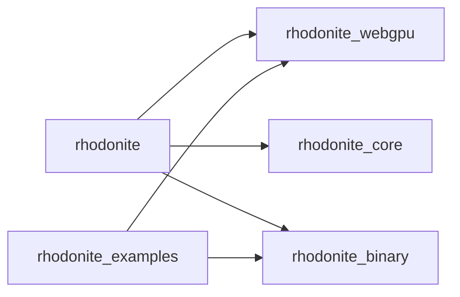

# Module boundaries

RhodoniteMBT groups several modules in a [Moon workspace](https://docs.moonbitlang.com/en/latest/toolchain/moon/workspace.html) via the root [`moon.work`](../moon.work).

## Workspace modules

| Moon module (`moon.mod.json` `name`) | Directory | Role |
|--------------------------------------|-----------|------|
| `emadurandal/rhodonite` | [`moon/rhodonite/`](../moon/rhodonite/) | Thin public facade; aggregates lower modules. |
| `emadurandal/rhodonite_binary` | [`moon/rhodonite_binary/`](../moon/rhodonite_binary/) | Little-endian writes into GPU-facing buffers, etc. |
| `emadurandal/rhodonite_core` | [`moon/rhodonite_core/`](../moon/rhodonite_core/) | Vectors, JS bridge (`src/math/`), and other core code. |
| `emadurandal/rhodonite_webgpu` | [`moon/rhodonite_webgpu/`](../moon/rhodonite_webgpu/) | WebGPU abstraction (browser and native). |
| `emadurandal/rhodonite_examples` | [`moon/rhodonite_examples/`](../moon/rhodonite_examples/) | Runnable samples (demo module). |

## Release units (what goes on mooncakes)

Run `moon publish` **once per module** below (from each module directory). Publishing in dependency order (fewer deps first) is recommended.

1. `emadurandal/rhodonite_binary`
2. `emadurandal/rhodonite_core`
3. `emadurandal/rhodonite_webgpu` (external: `moonbitlang/async`, `Milky2018/wgpu_mbt`, `Kaida-Amethyst/sdl3`)
4. `emadurandal/rhodonite` (after replacing the three path deps above with **versioned** registry deps)
5. `emadurandal/rhodonite_examples` (optional; not required for library consumers)

You may also keep a `samples`-style module unpublished and distribute it only from this GitHub repo.

## Dependency direction (allowed edges)

- **Disallowed**: `rhodonite_examples` depending on `emadurandal/rhodonite` (facade); samples should reference lower libraries directly.
- **Disallowed**: `rhodonite_webgpu` depending on `rhodonite_examples`.

During development, link workspace members with [`path` dependencies](https://docs.moonbitlang.com/en/stable/toolchain/moon/module.html#dependency-management). Before publishing, replace `path` entries in dependents’ `moon.mod.json` with **semver** strings (use `moon work sync` if needed).

## Publish checklist (short)

1. Logged in with `moon login` (mooncakes.io).
2. From the root, run `moon fmt` and `moon info`; confirm only intended `.mbti` changes.
3. From the root, `moon check --target all` passes.
4. In the module you publish, update `deps` workspace members to registry versions in `moon.mod.json`.
5. From each module directory, `moon publish` (e.g. `moon -C moon/rhodonite_webgpu publish`).

Fully automated staging (rewrite all path deps to versions in one shot) could be added later in the style of [kagura](https://github.com/mizchi/kagura) `just release-stage`.
