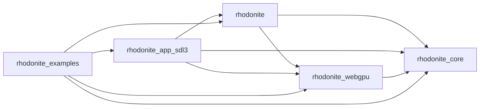

# Module boundaries

RhodoniteMBT groups several modules in a [Moon workspace](https://docs.moonbitlang.com/en/latest/toolchain/moon/workspace.html) via the root [`moon.work`](../moon.work).

## Workspace modules

| Moon module (`moon.mod.json` `name`) | Directory | Role |
|--------------------------------------|-----------|------|
| `emadurandal/rhodonite` | [`moon/rhodonite/`](../moon/rhodonite/) | Public facade; aggregates lower modules and exposes high-level app/runtime helpers. |
| `emadurandal/rhodonite_app_sdl3` | [`moon/rhodonite_app_sdl3/`](../moon/rhodonite_app_sdl3/) | SDL3 native app runtime helpers for window/event loop and Metal WebGPU bootstrap. |
| `emadurandal/rhodonite_core` | [`moon/rhodonite_core/`](../moon/rhodonite_core/) | Vectors, JS bridge (`src/math/`), little-endian buffer writes including native raw `MutArrayView` writers (`src/binary/writes`), ECS ([`docs/ecs.md`](ecs.md)), platform-independent input state ([`docs/input_architecture_ja.md`](input_architecture_ja.md)), and the ECS microbench package (`src/ecs_bench`). |
| `emadurandal/rhodonite_webgpu` | [`moon/rhodonite_webgpu/`](../moon/rhodonite_webgpu/) | WebGPU abstraction (browser and native). |
| `emadurandal/rhodonite_examples` | [`moon/rhodonite_examples/`](../moon/rhodonite_examples/) | Runnable samples (demo module). |

## Release units (what goes on mooncakes)

Run `moon publish` **once per module** below (from each module directory). Publishing in dependency order (fewer deps first) is recommended.

1. `emadurandal/rhodonite_core`
2. `emadurandal/rhodonite_webgpu` (after `rhodonite_core`; external: `moonbitlang/async`, `Milky2018/wgpu_mbt`)
3. `emadurandal/rhodonite` (after replacing the path deps above with **versioned** registry deps)
4. `emadurandal/rhodonite_app_sdl3` (after `rhodonite`; external: `Milky2018/wgpu_mbt`, `Kaida-Amethyst/sdl3`)

`emadurandal/rhodonite_examples` is repo-only and is not published by the release script.

## Dependency direction (allowed edges)

- **Allowed**: `rhodonite_examples` may depend on `emadurandal/rhodonite` for high-level app/runtime samples while still importing lower libraries directly for focused low-level WebGPU and ECS examples.
- **Disallowed**: `rhodonite_webgpu` depending on `rhodonite_examples`.
- **Input adapters**: platform-independent input state lives in `rhodonite_core/input`; browser runtime lives in `emadurandal/rhodonite/app/browser`, and SDL3 native runtime lives in `emadurandal/rhodonite_app_sdl3/sdl3`.

During development, link workspace members with [`path` dependencies](https://docs.moonbitlang.com/en/stable/toolchain/moon/module.html#dependency-management). Before publishing, replace `path` entries in dependents’ `moon.mod.json` with **semver** strings (use `moon work sync` if needed).

## Publish checklist (short)

1. Logged in with `moon login` (mooncakes.io).
2. From the root, run `moon fmt` and `moon info`; confirm only intended `.mbti` changes.
3. From the root, `moon check --target all` passes.
4. In the module you publish, update `deps` workspace members to registry versions in `moon.mod.json`.
5. From each module directory, `moon publish` (e.g. `moon -C moon/rhodonite_webgpu publish`).

From the repo root, [`scripts/publish-rhodonite-mooncakes.sh`](../scripts/publish-rhodonite-mooncakes.sh) runs `moon fmt`, `moon info`, `moon check --target all`, publishes core, temporarily rewrites `moon/rhodonite_webgpu/moon.mod.json`'s core path dep to semver, publishes webgpu, temporarily rewrites `moon/rhodonite/moon.mod.json` path deps to semver, publishes the facade, temporarily rewrites `moon/rhodonite_app_sdl3/moon.mod.json` path deps to semver, publishes the SDL3 app runtime, then restores the workspace files. Invoke via `just publish-mooncakes` or `pnpm run publish:moon`. Does **not** publish `rhodonite_examples`. Use `PUBLISH_MOON_DOWNSTREAM_ONLY=1` when core/webgpu are already published, or `PUBLISH_MOON_APP_SDL3_ONLY=1` to retry only the SDL3 app runtime.
