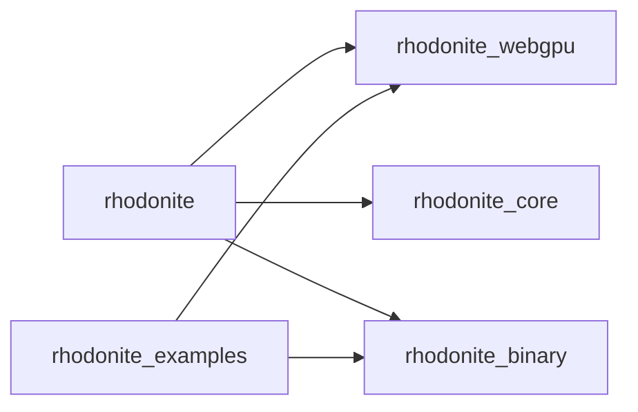

# Module boundaries

RhodoniteMBT は [Moon workspace](https://docs.moonbitlang.com/en/latest/toolchain/moon/workspace.html)（ルートの [`moon.work`](../moon.work)）で複数モジュールをまとめている。

## Workspace modules

| Moon module (`moon.mod.json` の `name`) | ディレクトリ | 役割 |
|----------------------------------------|--------------|------|
| `emadurandal/rhodonite` | [`moon/rhodonite/`](../moon/rhodonite/) | 公開用の薄い facade。下位モジュールへの依存を束ねる。 |
| `emadurandal/rhodonite_binary` | [`moon/rhodonite_binary/`](../moon/rhodonite_binary/) | GPU 向けバッファへの little-endian 書き込みなど。 |
| `emadurandal/rhodonite_core` | [`moon/rhodonite_core/`](../moon/rhodonite_core/) | ベクトル演算と JS bridge（`src/math/`）などコア。 |
| `emadurandal/rhodonite_webgpu` | [`moon/rhodonite_webgpu/`](../moon/rhodonite_webgpu/) | WebGPU（ブラウザ・ネイティブ）抽象化。 |
| `emadurandal/rhodonite_examples` | [`moon/rhodonite_examples/`](../moon/rhodonite_examples/) | 実行可能サンプル（デモ用モジュール）。 |

## Release units（mooncakes に載せる単位）

次の **モジュールごとに** `moon publish`（各ディレクトリで実行）。依存がないものから順に上げるとよい。

1. `emadurandal/rhodonite_binary`
2. `emadurandal/rhodonite_core`
3. `emadurandal/rhodonite_webgpu`（外部: `moonbitlang/async`, `Milky2018/wgpu_mbt`, `Kaida-Amethyst/sdl3`）
4. `emadurandal/rhodonite`（上記 3 つへの **バージョン依存**に差し替えたうえで）
5. `emadurandal/rhodonite_examples`（任意。ライブラリ利用者には必須ではない）

`samples` モジュールは publish 対象から外し、GitHub のこのリポジトリだけで配布する、という運用もありうる。

## Dependency direction（許可される依存）

- **禁止の例**: `rhodonite_examples` が `emadurandal/rhodonite`（facade）に依存する（サンプルは下位ライブラリのみを直接参照する）。
- **禁止の例**: `rhodonite_webgpu` が `rhodonite_examples` に依存する。

開発時はメンバー間を [`path` 依存](https://docs.moonbitlang.com/en/stable/toolchain/moon/module.html#dependency-management)で結ぶ。registry に出す直前に、依存側の `moon.mod.json` で path を **semver 文字列**へ置き換える（必要なら `moon work sync`）。

## Publish checklist（簡易）

1. `moon login` 済み（mooncakes.io）。
2. ルートで `moon fmt` と `moon info` を実行し、意図した `.mbti` の差分だけになっていることを確認する。
3. ルートで `moon check --target all` が通ることを確認する。
4. publish するモジュールの `moon.mod.json` で、`deps` の workspace メンバーを registry のバージョンへ更新する。
5. 各モジュールディレクトリで `moon publish`（例: `moon -C moon/rhodonite_webgpu publish`）。

完全自動の staging（path を一括でバージョンへ変換するスクリプト）は [kagura](https://github.com/mizchi/kagura) の `just release-stage` 型を将来追加できる。
